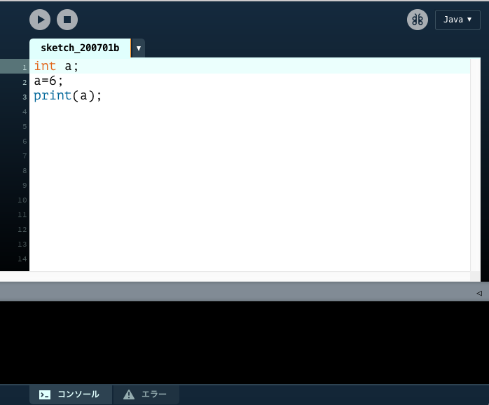
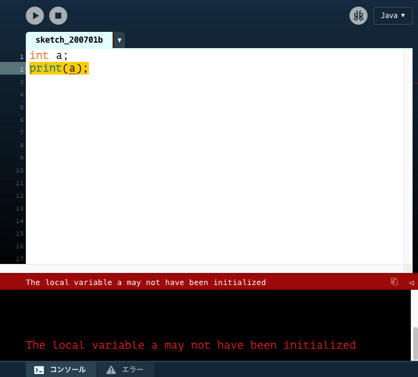
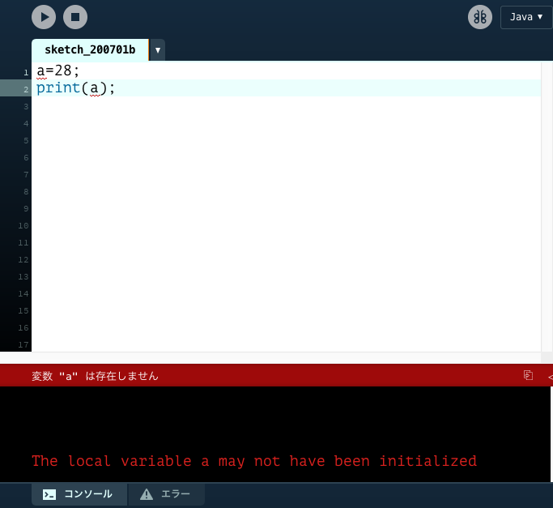

# 変数

## 今回の目標
変数の使い方と，使う利点がわかる．

## まえおき
プログラミングらしい話になってきます．

## 定義と代入
### 変数とは
箱です．何かを入れて保管(記憶)しておくことができます．

### 箱の作り方
```java
int a;
```
これでaという名前の箱が作られました．```int```は「整数を入れる箱を作れ」というおまじないです．
実行してでてきた小さいウィンドウ[^1]は無視しましょう．

[^1]:size();関数で何も設定しなかったので最小サイズのウィンドウがでてきてしまいました．

### 箱に数を入れる

このままだと，箱が空っぽなので数を入れます
```java
int a;
a=6;
```
```a=6```の行が追加されました．これでaという名前の箱に6が入りました．注意するのはここでのイコール=は，等しいという意味ではありません．イコールの右にある数をaに「代入する」という意味です．
ところで，本当にaに6が入っているかどうか気になりますね．そこで，aという箱の中に何が入っているかを確認します．
```java
int a;
a=6;
print(a);
```

下の黒いところがコンソールです．

```print();```命令は，コンソールに表示させる命令です．



実行ボタンを押すとそこに6と表示されます．


地味ですね．別の数字も試して，結果がどうなるかを確認しましょう．また，次のコードのように定義と代入を同時に行うことができます．

```java
int a=6;
print(a);
```

変数は別に一文字でなくてもよいです．
```java
int apple=6;
int grape=4;
print(apple,grape);
```
このように変数に適切な名前を付けることで何を表しているのかを分かりやすくできます．

変数の命名ですが，
- アルファベット(大文字小文字問わない)かアンダーバーで始まる
- 一文字目以外はアルファベット，数字，アンダーバーのみで構成されている
ことがルールです．

```java
int w1000000007ushitapunikiakun;//よい
int _x;//よい
int 3_e;//エラー
```

### 変数を使用するときのエラー

今度は値を代入せずに表示させます．

```java
int a;
print(a);
```

実行すると



英語ができてました．エラー文といいます．これを読んで何がエラーの原因なのかを考えます．英語が読めなかったのでGoogle先生に任せます．


原因はaに何も値を入れていないことです．aという変数を作ったけれど，中身は空っぽなので表示できません！という意味です．変数の中身を使う場合は中身を入れてあるかに注意しましょう．


また，```int a```でaという名前の変数を作らなかった場合もエラーになります．

```java
a=28;
print(a);
```



他にも，同じ名前の変数は作れないルールがあります．[^2]．

```java
int a;
int a;//変数名は被ってはいけない(エラー)
a=2;
```
[^2]:厳密には，同じブロック内でなければ問題ありませんが，今は気にしなくてよいです．


## 式で代入

```java
int a;
a=1+3;
print(a);
```

このように式で代入することもできます．

| すること | 演算子 |例|aの値 |
| :-: | :-: |:-:|:-:|
| 足し算 | ```+```|```a=24+41```|```65```|
| 引き算 | ```-```|```a=5-12```|```-7```|
|掛け算|```*```|```a=25*8```|```200```|
|割り算[^3]|```/```|```a=76/19```|```4```|
|割った余り[^4]|```%```|```a=25%4```|```1```|

[^3]:整数同士で割り算をすると，小数点以下は切り捨てられます．10/3=3,3/4=0となります．

[^4]:数学でいうと合同式のmodのようなものです．例えば，整数aの一の位はa%10で得ることができます．


変数を使って計算することも可能です．電卓みたいですね．

```java
int grape=3;
int apple=5;
int fruit=grape+apple;
print(fruit);
```

```java
int side=9;
int volume=side*side*side;
print(volume);
```

演算は括弧を使うことも可能です．

```java
int a=5,b=3;
int c=(a+b)*(a-b);//8*2
print(c);//16
```

次のコードを確認しましょう．

```java
int a=5;
a=a+6;
print(a);
```

このプログラムは少しトリッキーに見えるかもしれませんが，理路整然とシュミレーションしてみれば難しくありません．aという名前の箱にa+6の結果を代入するという意味ですが，このときのaは5ですので，aには5+6の11が代入されます．

プログラムは上から下へ順番に，書いてあること通りに実行されていきます．これは，当たり前のように感じますが，慣れていない頃は意外と忘れがちです．

また，セミコロンで区切ってさえあれば同じ行に命令を連ねることができますが，これは左から順番に実行されていきます．
次のソースコードでは，```a=b```と```b=a```が同じ行にあり，同時に実行するように見えるかもしれませんが，そんなことはありません．```a=b;```のあとに改行したコードと全く同じ意味になります．

```java
int a=5,b=3;
a=b;b=a;
print(a,b);
```

```java
int a=5,b=3;
a=b;
b=a;
print(a,b);
```

逆に，一行に詰め込むことも可能です．

```java
int a=5,b=3;a=b;b=a;print(a,b);
```

### 演習3-1
>次のプログラムを実行して表示される数はいくつか．
>```java
>int a=5;
>int b=3;
>a=a+b;
>b=a-b;
>print(b);
>```


### 演習3-2
>二つの変数の値を入れ替えるにはどうすればよいか
>```java
>int a=5,b=3;
>//何らかの処理
>print(a,b);//a=5,b=3を得たい
>```

### 解答
<details><summary>解答</summary><div>
演習3-1：5
上から順に実行されることに注意です．

```java
a=a+b;//a=5+3 aが8
b=a-b;//b=8-3 bが5
```

演習3-2：
別の変数を用意すると簡単に実現できます
```java
int a=5,b=3;
int t=a;//tにaの値を取っておく
a=b;//aに上書きされても
b=t;//tにもともとのaの値が残っている
print(a,b);
```

</div></details>


## 変数の活用例
打つのが大変なのでコピペ推奨です．

```java
size(600,600);
ellipse(300,300,200,200);
fill(0,0,0);
ellipse(250,280,50,50);
ellipse(350,280,50,50);
line(250,350,350,350);
```


チャプター2で出てきた顔です．
どうしてもこの顔が気に入らなければ別の絵を用意してもらって構いません．

この顔をもう少し右に表示させたくなったとします．そうなると，顔を作っている全ての関数のx座標の値を変えなければなりません．手間です．さらに変更したくなったらまたまたひとつずつ書き換えなければなりません．非常に面倒ですね．そこで，次のように変数を使います．

```java
int x=300,y=300;
size(600,600);
ellipse(x,y,200,200);
fill(0,0,0);
ellipse(x-50,y-20,50,50);
ellipse(x+50,y-20,50,50);
line(x-50,y+50,x+50,y+50);
```
これで，一行目のxとyの初期値さえ変えれば，顔の位置を移動させることができるようになりました．このように，複数の場所に関与して来る数は変数にしておくと汎用性が高くなります．