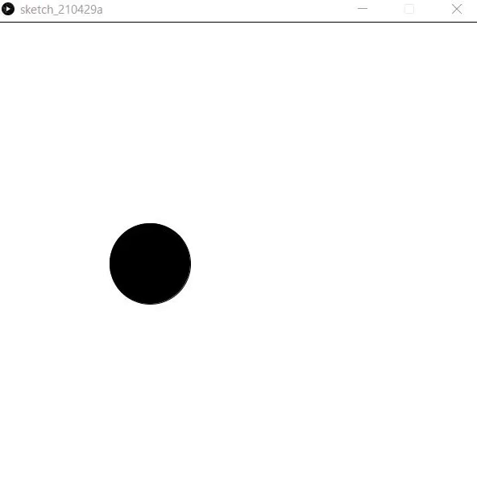
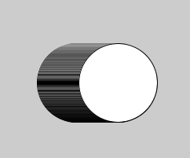

# 動きを作る
## 目標
図形を動かすことができる



## setup()とdraw()
```java
//ここで変数の宣言をする

void setup(){
    //初めの設定：変数への代入，size()命令など
}

void draw(){
    //ここがずっと繰り返される
}
```

急にvoid setup()やらdraw()が出てきて困惑するかもしれませんが，これはそういうものだと思ってください．

例を次に示します．

```java
int x=300,y=300;

void setup(){
    size(600,600);
}

void draw(){
    ellipse(x,y,100,100);
    x=x+1;
}
```

draw()に円を描くプログラムと`x=x+1`が入っています．draw()の中は繰り返されるのでxの値がどんどん増えていきます．print(x)を後ろにおいてみるとよくわかります．
draw()は，だいたい1秒間に60回実行されています．つまり，xは1秒で約60増えています．



この実行結果ですが，xをずらしながら円を描いているので残像がついています．

そこで，draw()の初めで白い画面いっぱいの正方形で画面を塗りつぶして，一回まっさらの状態にします．
```java
int x=300,y=300;

void setup(){
    size(600,600);
}

void draw(){
    fill(255,255,255);
    rect(0,0,600,600);
    fill(0,0,0);
    ellipse(x,y,100,100);
    x=x+1;
}
```
これで，残像がなくなりました．実行結果はこのチャプターの頭にあるgif画像です．

## さらに動かす

前回使用した顔を描くプログラムについても同じことができます．

```java
int x=300;
int y=300;

void setup(){
    size(600,600);
}

void draw(){
    fill(255,255,255);
    rect(0,0,600,600);//画面を真っ白に
    
    ellipse(x,y,200,200);
    fill(0,0,0);
    ellipse(x-50,y-20,50,50);
    ellipse(x+50,y-20,50,50);
    line(x-50,y+50,x+50,y+50);//顔を描く
    
    x=x+1;
}
```

左方向や斜め方向に移動させるにはどうすればよいでしょうか．また，等速直線運動ではなく等加速度運動にするにはどうすればようでしょうか．

次のプログラムでは，x方向とy方向のそれぞれの速度を変数として定義しています．`x=x+2;y=y+1;`のように直接書きたくもなりますが，これを変数として宣言しておくことで汎用性が高いプログラムになります．


```java
int x=300,y=300;//座標
int vx=2,vy=1;//速度

void setup(){
    size(600,600);
}

void draw(){
    //中略
    
    x=x+vx;
    y=y+vy;
}
```

具体的には，次のプログラムのように加速度を導入したときに，これらの数を変数として宣言しておくと，初期値の設定がはじめの数行でまとめてできるので楽です．

```java
int x=300,y=300;//座標
int vx=-10,vy=0;//速度
int ax=1,ay=0;//加速度

void setup(){
    size(600,600);
}

void draw(){
    //中略

    vx=vx+ax;
    vy=vy+ay;
    x=x+vx;
    y=y+vy;
}
```

ところで，ここまで作ってきたプログラムは顔が画面外に出てしまうともう戻ってきません．もし画面外に出たとき，戻ってくる，という処理が欲しいですよね？


それを実現するのが次のチャプターで出てくるif文です．

## おまけ

```java
int x=300,y=300;

void setup(){
    size(600,600);
}

void draw(){
    fill(255,255,255);
    rect(0,0,600,600);//画面を真っ白に
    
    x=mouseX;y=mouseY;
    ellipse(x,y,200,200);
    fill(0,0,0);
    ellipse(x-50,y-20,50,50);
    ellipse(x+50,y-20,50,50);
    line(x-50,y+50,x+50,y+50);//顔を描く
}
```
