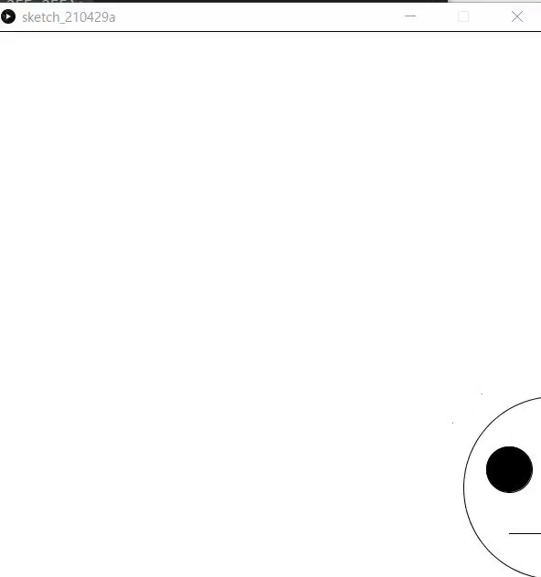

# 分岐処理
## 目標
次の動きをするプログラムを作成できる



## いつ使うのか
ゲームとかでボタンを押すとキャラクターが動きますね．ボタンが押されたときと押されていないときで処理が違います．「もし〜ならこの処理をする」というのが欲しいですね．それがこれから紹介するif文です．

##  もし〜だったら
「もしAだったらBをする」をプログラムにすると次のコードになります．

```java
if(A){
    B
}
```

Bには命令が入り，Aには条件式が入ります．

| 条件式 | 日本語 | 
| :-: | :-: |
|`a==b`| aとbが等しい |
|`a>b`| aがbより大きい |
|`a>=b`| aがb以上 |
|`a<b`| aがbより小さい |
|`a<=b`| aがb以下 |

**aとbが等しい時の条件式が=ではなく==であることに注意です．**

次のプログラムでaの値を変えたり条件式を変えたりして動作を確認しましょう．

```java
int a=100;

if(a==100){ // もし、aが100なら
  println("aは100です");
}

if(a>100){// aが100より大きいなら
  println("aは100より大きいです");
}
```

また，条件を連ねたいときは`&&`を使います．"かつ"と読み替えることができます．次のプログラムはaが100以上，かつaが200未満，という条件になります．

```java
int a=100;

if( 100<=a && a<200 ){ // aが100以上200未満なら
  println("aは100以上200未満です");
}
```

"かつ"(`&&`)に対して，`||`[^1]は"または"を表す記号です．
次のプログラムはageが7である，またはageが5である，またはageが3であるときに"七五三"を表示するプログラムです．

[^1]:見慣れない記号かもしれません，パイプラインと呼びます．キーボードの右上の方にあります．

```java
int age=10000;

if(age==7 || age==5 || age==3){
    println("七五三");
}
```

### 練習

#### 演習5-1
> `int score=任意の整数;`に対して，scoreが60未満の場合に「留年」と表示するプログラムを作成しなさい．

#### 演習5-2
> 演習5-1に加えて，scoreが101以上の場合も"留年"と表示するプログラムを作成しなさい．

#### 解答例
<details><summary>解答例:コードを書いてから答えをみよう！</summary><div>
演習5-2:

```java
if(score<60){
    println("留年");
}
```
演習5-3:

```java
if(score<60||score>100){
    println("留年");
}
```
</div></details>

## else,else if
else（日本語: 他の）は文字通りそうでないときの処理を書きます．
次のif文では，`score<60`の条件を満たさなかった場合，`else`の方が実行されます．

```java
int score=74;
if(score<60){
    println("不可");
}else{
    println("合格");
}
```

次の2つのプログラムと実行結果を比較してみましょう

```java
int score=54;
if(score<60){
<<<<<<< HEAD
    println("不可");
    println("課題を提出してもらったので点数を60点にしてあげます");
=======
    print("不可");
    print("課題を提出してもらったので点数を60点にしてあげます")
>>>>>>> b20bcb7dd3a1ff641b1f60ef110d0bbe84e187f8
    score=60;
}else{
    println("合格");
}
```

```java
int score=54;
if(score<60){
<<<<<<< HEAD
    println("不可");
    println("課題を提出してもらったので点数を60点にしてあげます");
=======
    print("不可");
    print("課題を提出してもらったので点数を60点にしてあげます")
>>>>>>> b20bcb7dd3a1ff641b1f60ef110d0bbe84e187f8
    score=60;
}
if(score>=60){
    println("合格");
}
```


## 実際に使う

前回のチャプターで作った顔が動くプログラムで，xが無限に増え続けるので画面外にいってしまいます．そこでif文を使うと，右端にいったら左端から出てくるようにすることができます．


```java
int x=300;
int y=300;

void setup(){
    size(600,600);
}

void draw(){
    fill(255,255,255);
    rect(0,0,600,600);//画面を真っ白に

    ellipse(x,y,200,200);
    fill(0,0,0);
    ellipse(x-50,y-20,50,50);
    ellipse(x+50,y-20,50,50);
    line(x-50,y+50,x+50,y+50);//顔を描く

    x=x+3;
    if(x>700){//もしxが700を超えたら
        x=-100;//xを-100に設定する
    }
}

```

y座標についても同じことをしてやると，古いDVDプレイヤーにスクリーンセーバーにありそうなちょっと面白い動きになります．

```java
int x=300;
int y=300;
int vx=9,vy=6;

void setup(){
    size(600,600);
}

void draw(){
    fill(255,255,255);
    rect(0,0,600,600);//画面を真っ白に

    ellipse(x,y,200,200);
    fill(0,0,0);
    ellipse(x-50,y-20,50,50);
    ellipse(x+50,y-20,50,50);
    line(x-50,y+50,x+50,y+50);//顔を描く

    x=x+vx;
    y=y+vy;
    if(x>700){//もしxが700を超えたら
        x=-100;//xを-100に設定する
    }
    if(y>700){//もしyが700を超えたら
        y=-100;//yを-100に設定する
    }
}

```
