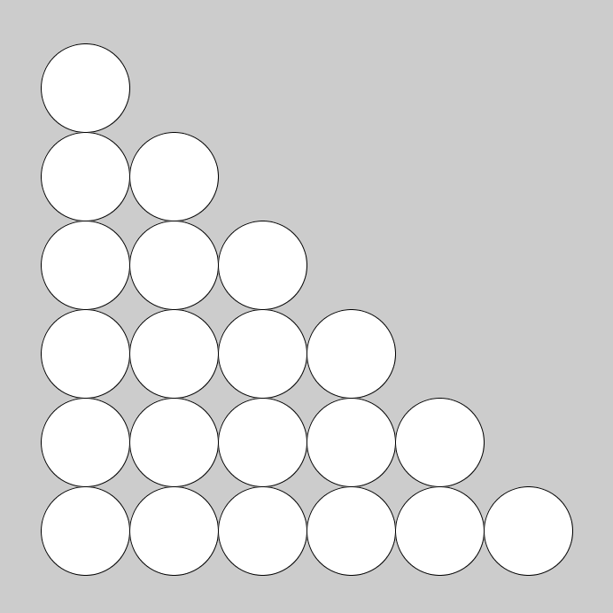

# Chapter 6:繰り返し処理

## まえおき
processingで次の画像のようなものを描くプログラムを作るにはどうすればよいでしょうか．


ellipse命令を羅列して地獄になる予感がします．そこで，同じ処理や似たような処理を行うのがwhile文，for文です．

## while文
whileには「～の間」という意味があります(接続詞として逆接の意味も持ちますが)．
プログラム上でも意味は同じで，「Aの間Bを繰り返し実行」する場合は

```java
while(A){
    B
}
```
と書きます．Aにはif文でも使用した条件式が入ります．

| 条件式 | 日本語 | 
| :-: | :-: |
|`a==b`| aとbが等しい |
|`a>b`| aがbより大きい |
|`a>=b`| aがb以上 |
|`a<b`| aがbより小さい |
|`a<=b`| aがb以下 |

プログラムを見てみましょう．
```java
int hp=20;
int attack=6;
while(hp>0){
    hp=hp-attack;
    print(hp);
}
print("GAME OVER");
```

動作の確認をするために，一個ずつ命令の通りにしたがってシュミレーションしてみましょう．

注意するのは，hp>0による，まだ繰り返すか否かを中括弧の終わりのところで審査することです．p=hp-attackでもしhp>0を満たしてなくても，中括弧が閉じているところまでの命令は実行され，print(hp);を実行した後にhp>0の判定が行われます．

while文を使えば，次のようにすることで100回繰り返すことができます．

```java
int i=1;
while(i<=100){
    print(i);
    i++;
}
```

ここで，変数iは繰り返し回数を表していますが，繰り返し処理を行うたびにいちいち準備するのは大変です．
そこで，便利なのがfor文です．

##　for文

for文の書式は次の通りです．

```java
for(変数の宣言;条件式;1回繰り返したあとに行う処理){
    //処理
}
```

```java
for(int i=1;i<=100;i++){
    print(i);
}
```

つまり，上のコードは1回for文内を実行してiを+1することをi<=100の間繰り返す，という意味になります．

while文と違って，
- 繰り返し用の変数の宣言
- 繰り返し用の変数への加算
- 繰り返しの条件
を同時に設定することができるます．


使い分けですが，繰り返す回数が決まっている場合はすっきり書けるfor文，そうでない場合はwhile文を使うことが多いです．

### 演習6-1
>1から2020までの整数の和は2041210ですが，これをfor文かwhile文を使ったプログラムによって計算しなさい．


### 演習6-2
> 1以上10000以下の整数で，6の倍数である，または9の倍数である整数の個数を求めなさい．

### 解答

<details><summary>解答</summary><div>

演習6-1:

```java
int sum=0;
for(int i=1;i<=2020;i++)sum+=i;
print(sum);
```

演習6-2:2222
```java
int cnt=0;
for(int i=1;i<=10000;i++)if(i%6==0||i%9==0)cnt++;
print(cnt);
```

これは，10000/6+10000/9-10000/18と等しいです．

</div></details>


## 二重for文

```java
size(500,500);
for(int x=0;x<=500;x+=100)ellipse(x,000,100,100);
for(int x=0;x<=500;x+=100)ellipse(x,100,100,100);
for(int x=0;x<=500;x+=100)ellipse(x,200,100,100);
for(int x=0;x<=500;x+=100)ellipse(x,300,100,100);
for(int x=0;x<=500;x+=100)ellipse(x,400,100,100);
for(int x=0;x<=500;x+=100)ellipse(x,500,100,100);
```


上のfor文は
```java
size(500,500);
for(int y=0;y<=500;y+=100){
  for(int x=0;x<=500;x+=100){
    ellipse(x,y,100,100);
  }
}
```

こうまとめられますね．

### 演習6-3
> 次の画像のように階段状に円を描くにはどうすればよいでしょうか．


### 解答
<details><summary>解答</summary><div>
演習6-3:
一例です．

```java
size(700,700);
for(int y=100;y<=600;y+=100){
  for(int x=100;x<=y;x+=100){
    ellipse(x,y,100,100);
  }
}
```

</div></details>
