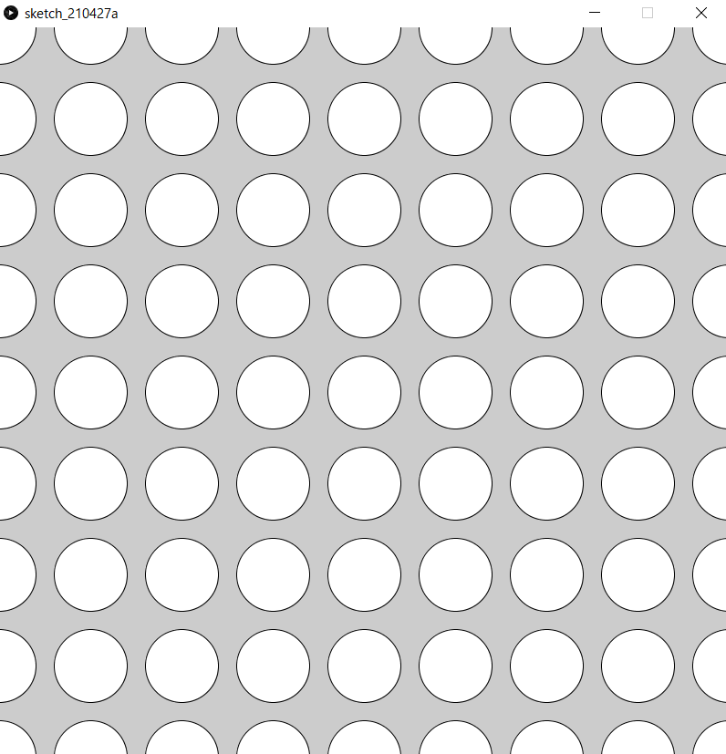

# Chapter 6:繰り返し処理


## 前提知識
[補足資料/演算子](../ProcessingOther/operator.md)

## まえおき
processingで次の画像のようなものを描くプログラムを作るにはどうすればよいでしょうか．


ellipse命令を羅列して地獄になる予感がします．そこで，同じ処理や似たような処理を行うのがwhile文，for文です．
```java
size(800,800);

ellipse(0,0,50,50);
ellipse(100,0,50,50);
ellipse(200,0,50,50);
ellipse(300,0,50,50);
ellipse(400,0,50,50);
//...大変
```

## while文
whileには「～の間」という意味があります．
プログラム上でも意味は同じで，「Aが正しい間，Bを繰り返し実行」する場合は

```java
while(A){
    B
}
```
と書きます．Aにはif文でも使用した条件式が入ります．

| 条件式 | 日本語 | 
| :-: | :-: |
|`a==b`| aとbが等しい |
|`a>b`| aがbより大きい |
|`a>=b`| aがb以上 |
|`a<b`| aがbより小さい |
|`a<=b`| aがb以下 |

プログラムを見てみましょう．
```java
int hp=20;
int attack=6;
while(hp>0){
    hp=hp-attack;
    print(hp);
}
print("GAME OVER");
```

動作の確認をするために，一個ずつ命令の通りにしたがってシュミレーションしてみましょう．

- hp=20,attack=6として変数が宣言
- while文に入る
  - hp>0であるため，中括弧``{}``内を実行する
  - hp=20-6=14となり，14が表示される
  - hp>0であるため，中括弧内を実行する
  - hp=14-6=8となり，8が表示される
  - hp>0であるため，中括弧内を実行する
  - hp=8-6=2となり，2が表示される
  - hp>0であるため，中括弧内を実行する
  - hp=2-6=-4となり，-4が表示される
  - hp>0を満たしていないため，while文を抜ける
- ``GAME OVER``と表示される

注意するのは，**まだ繰り返すか否かを判定する場所です**．
上の例では，``p=hp-attack``の時点で``hp=-4``で``hp>0``を満たしていませんが，その後の``print(hp)``は実行されています．これは，中括弧内の一連の処理を終えてから，まだループするかどうかの判定``hp>0``を行っているからです．
while文を使えば，次のよう[^1]にすることで100回繰り返すことができます．

```java
int i=1;
while(i<=100){
    print(i);
    i++;
}
```

ここで，変数iは繰り返し回数を表していますが，繰り返し処理を行うたびにいちいち準備するのは大変です．
そこで，便利なのがfor文です．

[^1]:`i++`という書き方については[補足資料/演算子](../ProcessingOther/operator.md)をご覧ください

##　for文

for文の書式は次の通りです．

```java
for(変数の宣言;条件式;1回繰り返したあとに行う処理){
    //処理
}
```

```java
for(int i=1;i<=100;i++){
    print(i);
}
```

つまり，上のコードは，
- 始めにi=0と宣言
- ``i<=100``を満たしている間，次を繰り返す
  - ``i``を表示する
  - ``i``を1増やす

while文と挙動が似ていますね．次のように書き換えることができます[^2]．
```java
int i=1;
while(i<=000){
  print(i);
  i++;
}
```

[^2]:実は，変数``i``のスコープは異なります．詳しくは[補足資料/変数の詳しい話](../ProcessingOther/var.md) をご覧ください


for文は，
- 繰り返し用の変数の宣言
- 繰り返し用の変数への加算
- 繰り返しの条件
を同時に設定することができるます．


使い分けですが，繰り返す回数が決まっている場合はすっきり書けるfor文，そうでない場合はwhile文を使うことが多いです．

次のように図形をたくさん連ねる処理を簡単にかけるのはfor，whileの強みです．

```java
size(800,300);

for(int x=50;x<800;x+=100){
  ellipse(x,150,100,100);
  //中心(x,150),半径100の円
}
```


### 演習6-1
>1から100までの整数の和は5050ですが，これをfor文かwhile文を使ったプログラムによって計算しなさい．

### 演習6-2
> 上の円を横に連なった絵を描くプログラムをwhile文を使って書きなさい．

### 解答

<details><summary>解答</summary><div>

演習6-1: 5050です．``100*(100+1)/2``と計算できます．
```java
int sum=0;
for(int i=1;i<100;i++)sum+=i;
print(sum);
```
繰り返す処理が1文の場合は
中括弧を省略することができます．

演習6-2:
```java
size(800,300);

int x = 50;
while(x<800){
  ellipse(x,150,100,100);
  x+=100;
}
```


</div></details>

## たくさんの図形を動かそう

次のようにたくさんの図形を描いて動かすことができます．

```java
int x=0;

void setup(){
  size(800,300);
}

void draw(){
  fill(0);
  rect(0,0,800,300);
  fill(255);
  for(int dx=-50;dx<=800;dx+=50){
    ellipse(x+dx, 150, 50, 50);
  }
  x++;
}
```


draw()内の最後(``}``の前)に``if(x>=50)x=0;``を追加してみましょう


三角関数と組み合わせて，角度をfor文で回すことも可能です．
```java
float r=0;

void setup(){
  size(600,600);
}

void draw(){
  fill(0);
  rect(0,0,600,600);
  fill(255);
  for(float a=0;a<=2*PI*0.8;a+=0.5){
    ellipse(300+cos(a+r)*200,300+sin(a+r)*200,50,50);
  }
  r+=0.1;
  if(r>2*PI)r-=2*PI;
}
```


ここまで勉強したことだけでも，様々な表現ができそうですね．是非試してみてください．

## 二重for文


各行に対して，for文で円を連ねています．

```java
size(500,500);
for(int x=0;x<=500;x+=100)ellipse(x,000,100,100);
for(int x=0;x<=500;x+=100)ellipse(x,100,100,100);
for(int x=0;x<=500;x+=100)ellipse(x,200,100,100);
for(int x=0;x<=500;x+=100)ellipse(x,300,100,100);
for(int x=0;x<=500;x+=100)ellipse(x,400,100,100);
for(int x=0;x<=500;x+=100)ellipse(x,500,100,100);
```


上のfor文は
```java
size(500,500);
for(int y=0;y<=500;y+=100){
  for(int x=0;x<=500;x+=100){
    ellipse(x,y,100,100);
  }
}
```

こうまとめられますね．

### 演習6-3
> 次の画像のようなマス目を書いてみましょう．


また，次の演習問題のようなこともできます．

### 演習6-4
> 次の画像のように階段状に円を描くにはどうすればよいでしょうか．


### 解答
<details><summary>解答</summary><div>

一例です．

演習6-3:

```java
size(500,500);

for(int x=0;x<500;x+=50){
  for(int y=0;y<500;y+=50){
    rect(x,y,49,49);
  }
}
```
line関数でも描くことができます．

演習6-4:

```java
size(700,700);
for(int y=100;y<=600;y+=100){
  for(int x=100;x<=y;x+=100){
    ellipse(x,y,100,100);
  }
}
```

</div></details>
