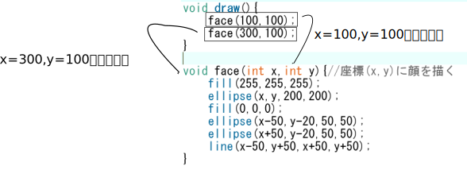
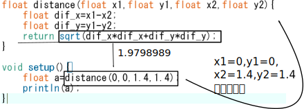

# Chapter 7:関数を作る

## 関数とは
実は今まで使ってきた`rect()`や`fill()`，`print()`などは関数と呼ばれるものです．

例えば，`rect(x,y,a,b)`を実行した場合，
座標(x,y)を左上の頂点として，横a縦bの長さである長方形が描かれます．`print(S);`(Sは文字列)は，文字列Sがコンソールに表示されます．
このように，関数はいくつかの入力(rectの例だとx,y,a,b)に対して何かを行うものです．

そして，この関数は自分で作ることができます．

## 引数
`rect(x,y,a,b);`について，x,y,a,bをそれぞれ引数(ひきすう)と呼びます．
また，引数それぞれには型が決まっていてrectの場合はfloat型です

## 関数を作る
関数を次のようにして定義できます．
```java
void 関数名(型 仮引数名，型 仮引数名，......){
    //
}
```
例です．
```java
void setup(){
    size(600,600);
}

void draw(){
    face(100,100);
    face(300,100);
}

void face(int x,int y){//座標(x,y)に顔を描く
    fill(255,255,255);
    ellipse(x,y,200,200);
    fill(0,0,0);
    ellipse(x-50,y-20,50,50);
    ellipse(x+50,y-20,50,50);
    line(x-50,y+50,x+50,y+50);
}
```

この例ではface(x,y)という関数を作っています．



引数は個数はいくつでもよいです．

```java
int x=0,y=0;

void setup(){
    size(600,600);
}

void draw(){
    clearScreen();
    face(x,y);
    x=x+4;y=y+3;
    if(x>700)x=-100;
    if(y>700)y=-100;
}

void clearScreen(){//引数が0個の関数
    fill(255,255,255);
    rect(0,0,600,600);
}


void face(int x,int y){//座標(x,y)に顔を描く
    fill(255,255,255);
    ellipse(x,y,200,200);
    fill(0,0,0);
    ellipse(x-50,y-20,50,50);
    ellipse(x+50,y-20,50,50);
    line(x-50,y+50,x+50,y+50);
}

```

`clearScreen()`という関数を作りました．引数が0個であり一見何の意味も成してないように見えますが，
```java
fill(255,255,255);
rect(0,0,600,600);
```
が
```java
clearScreen();
```
で，画面を真っ白にするという表現になったことで，何をしているかがわかりやすくなっています．
このように，関数の定義による一連の動作の抽象化はコードの可読性が増し，汎用性も高くなります．


## 戻り値のある関数
戻り値がある関数は次のように書けます．

```java
戻り値の型 関数名(型 仮引数名，型 仮引数名，......){
    return 戻り値;
}
```

使い方の例です．

```java
/*(x1,y1)と(x2,y2)のユークリッド距離を求める*/
float distance(float x1,float y1,float x2,float y2){
    float dif_x=x1-x2;
    float dif_y=y1-y2;
    return sqrt(dif_x*dif_x+dif_y*dif_y);
}

void setup(){
    float a=distance(0,0,1.4,1.4);
    println(a);
}
```



ちなみに，二つの点の距離がわかれば円の衝突判定をすることができますので考えてみてください．


## 変数のスコープ
例えば，`apple_cost`を`void draw()`中で使いたいときに次のようなコードを書いたとします．これはエラーになります．
なぜでしょうか．
```java
void setup(){
    int apple_cost=80;
    size(600,600);
}

void draw(){
    printf(apple_cost);
}
```

原因は変数のスコープです．スコープは範囲という意味です．実は，`void setup()`内で宣言された`apple_cost`という変数は，`void setup()`内でしか使用することができません．

あるブロック内で宣言された変数はそのブロック内でしか使用できません．
ブロックとは，中括弧`{`と`}`で囲まれた区間のことです．

`{`と`}`はfor文やif文などでも使われているので，これもブロックになります．
```java
void setup(){
    size(600,600);
}

void draw(){
    for(int i=0;i<10;++i){
        int foo=31;//このfor文内でしか使用できない
    }

    int hoge=3;
    if(hoge==3){
        int piyo;//このif文内でしか使用できない
    }
}
```

ブロックの垣根を超えて変数を使用する場合は，ブロックの外で変数の宣言をします．
特に，どのブロックにも属していない変数のことをグローバル変数といいます．

```java
int apple_cost=80;//グローバル変数

void setup(){
    size(600,600);
}

void draw(){
    printf(apple_cost);
}
```

また，同じブロックに属していなければ，区別が可能であるので変数の名前が被っていても問題ありません．

```java
int sum(int v1,int v2){
    int ans=v1+v2;
    return ans;
}

int mul(int v1,int v2){
    int ans=v1*v2;
    return ans;
}
```