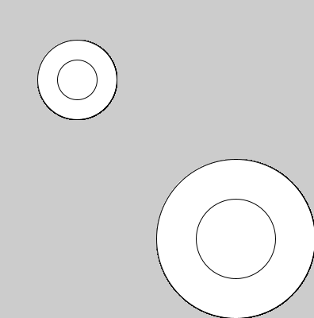
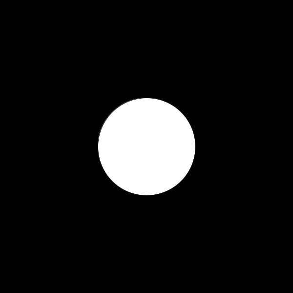

# Chapter 7:関数を作る

## 前提知識
[補足資料/変数の詳しい話](../ProcessingOther/var.md)

## 関数とは
実は今まで使ってきた`rect()`や`fill()`，`print()`などは関数と呼ばれるものです．

例えば，
- `rect(x,y,a,b)`で，座標`(x,y)`を左上の頂点として，横`a`縦`b`の長さである長方形が描かれます．
- `print(a)`では，変数`a`の内容が表示されます．
- `background(r,g,b)`では，背景色(r,g,b)で画面がクリアされます．

このように，関数は0個以上の入力(`rect`の例だと`x,y,a,b`)に対して何かを行うものです．

そして，この関数は自分で作ることができます．

## 引数
<<<<<<< HEAD
`rect(x,y,a,b);`について，`x,y,a,b`をそれぞれ引数(ひきすう)と呼びます．
また，引数それぞれには型が決まっていて`rect`の場合は`float`型です
=======
`rect(x,y,a,b);`について，x,y,a,bをそれぞれ引数(ひきすう)と呼びます．
また，引数それぞれには型が決まっていてrectの場合はfloat型です
>>>>>>> b20bcb7dd3a1ff641b1f60ef110d0bbe84e187f8

## 関数を作る
関数を次のようにして定義できます．
```java
void 関数名(型 仮引数名，型 仮引数名，......){
    //
}
```
例です．
```java
void setup(){
    size(600,600);
}

void draw(){
    face(100,100);
    face(300,100);
}

void face(int x,int y){//座標(x,y)に顔を描く
    fill(255,255,255);
    ellipse(x,y,200,200);
    fill(0,0,0);
    ellipse(x-50,y-20,50,50);
    ellipse(x+50,y-20,50,50);
    line(x-50,y+50,x+50,y+50);
}
```

<<<<<<< HEAD
この例では`face(x,y)`という関数を作っています．
=======
この例ではface(x,y)という関数を作っています．
>>>>>>> b20bcb7dd3a1ff641b1f60ef110d0bbe84e187f8


引数は個数はいくつでもよいです．

```java
int x=0,y=0;

void setup(){
    size(600,600);
}

void draw(){
    clearScreen();
    face(x,y);
    x=x+4;y=y+3;
    if(x>700)x=-100;
    if(y>700)y=-100;
}

void clearScreen(){//引数が0個の関数
    fill(255,255,255);
    rect(0,0,600,600);
}


void face(int x,int y){//座標(x,y)に顔を描く
    fill(255,255,255);
    ellipse(x,y,200,200);
    fill(0,0,0);
    ellipse(x-50,y-20,50,50);
    ellipse(x+50,y-20,50,50);
    line(x-50,y+50,x+50,y+50);
}

```

`clearScreen()`という関数を作りました．引数が0個であり一見何の意味も成してないように見えますが，
```java
fill(255,255,255);
rect(0,0,600,600);
```
が
```java
clearScreen();
```
で，画面を真っ白にするという表現になったことで，何をしているかがわかりやすくなっています．
このように，関数の定義による一連の動作の抽象化はコードの可読性が増し，汎用性も高くなります．


## 戻り値のある関数
戻り値がある関数は次のように書けます．

```java
戻り値の型 関数名(型 仮引数名，型 仮引数名，......){
    return 戻り値;
}
```

使い方の例です．

```java
/*(x1,y1)と(x2,y2)のユークリッド距離を求める*/
float distance(float x1,float y1,float x2,float y2){
    float dif_x=x1-x2;
    float dif_y=y1-y2;
    return sqrt(dif_x*dif_x+dif_y*dif_y);
}

void setup(){
    float a=distance(0,0,1.4,1.4);
    println(a);
}
```


<<<<<<< HEAD
### 演習7-1
> processingには，`background()`関数が用意されていて，色(r,g,b)で画面がクリアされる．
> `background()`関数と同じ挙動をする`myBackground()`関数を作成せよ[^1]．

[^1]: ここでは，`background()`関数がProcessingに用意されていなかったとする．つまり，`myBackground()`関数内に`background()`を置く，ということではなく，`rect()`関数などで画面を塗りつぶす方法を使用する．

### 演習7-2
> `doubleCircle(x,y,r)`と実行したとき，中心の座標が`(x,y)`で，直径が`r`と`r/2`の円による二重丸が描画される関数を作成してみよ．

実行例
```java
void setup(){
  size(400,400);
}

void draw(){
  doubleCircle(100,100,100);
  doubleCircle(300,300,200);
}
```


### 演習7-3
> マウスポインタと円の衝突判定をする関数を作りたい．具体的には，次のプログラムを実行すると，円にマウスポインタが触れたら色が変更される，という動作をするように，`isInCircle`関数を作成せよ．



```java
float ex=300;//円のx座標
float ey=300;//円のy座標
float r=100;//円の半径

void setup(){
  size(600,600);
}

void clearScreen(){//引数が0個の関数
    fill(255,255,255);
    rect(0,0,600,600);
}

/*
中心(cx,cy)半径rの円と点(ax,ay)の位置関係を返す
円の内部(境界線を含む)に点が入っている場合は1
円の外に点がある場合は0
が変える
*/
int isInCircle(float cx,float cy,float r,float ax,float ay){
    /*何かを書く*/
}

void draw(){
    clearScreen();//画面をまっさらに

    if(isInCircle(ex,ey,r,mouseX,mouseY)==1){
        fill(255,255,255);
        ellipse(ex,ey,r*2,r*2);
    }else{
        fill(0,255,255);
        ellipse(ex,ey,r*2,r*2);
    }

    ex+=5;//円を動かす
    if(ex>=600+r){ //右端にいったら左端に戻す
        ex=-r;
    }
}
```


### 解答

<details><summary>解答</summary><div>
演習 7-1:

画面の大きさがわからないため，十分に大きな長方形にしておく．
```java
void myBackground(int r,int g,int b){
  fill(r,g,b);
  rect(-10,-10,3000,3000);
}
```
実は，システム変数を使えば必要以上に大きな長方形を描く必要がない．
また，`noStroke()`関数で図形の枠線をなくすことができる．
```java
void myBackground(int r,int g,int b){
  fill(r,g,b);
  noStroke();//枠線なし
  rect(0,0,width,height);
}
```

演習 7-2:
```java
void doubleCircle(float x,float y,float r){
  ellipse(x,y,r,r);
  ellipse(x,y,r/2,r/2);
}
```

演習 7-3:
円の内部に入っているということは，円の中心からの距離が，円の半径の長さ以下ということです．円の中心と，ある点の位置の距離は三平方の定理で求めることができます．
```java
/*
中心(cx,cy)半径rの円と点(ax,ay)の位置関係を返す
円の内部(境界線を含む)に点が入っている場合は1
円の外に点がある場合は0
が変える
*/
int isInCircle(float cx,float cy,float r,float ax,float ay){
    float dx=(cx-ax);
    float dy=(cy-ay);
    if (sqrt(dx*dx+dy*dy)>=r){
        return 1;
    }else{
        return 0;
    }
}
```

</div></details>
=======
ちなみに，二つの点の距離がわかれば円の衝突判定をすることができますので考えてみてください．
>>>>>>> b20bcb7dd3a1ff641b1f60ef110d0bbe84e187f8

