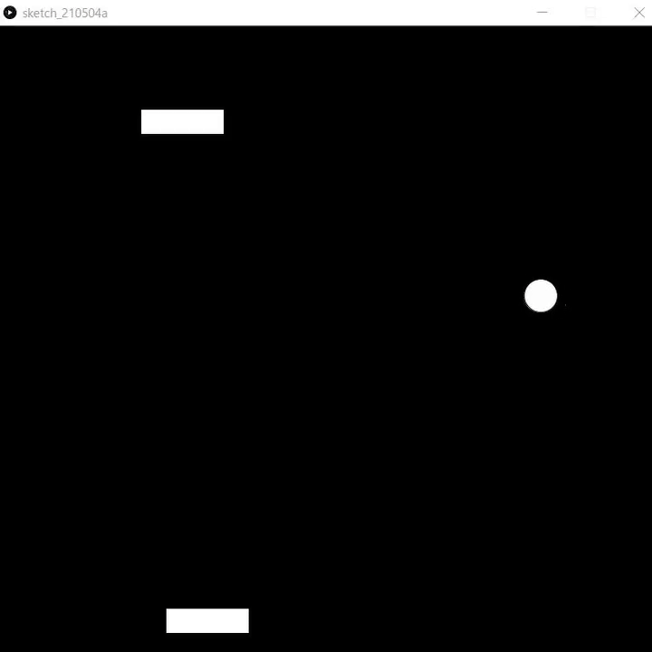

# Chpater 1:設計を考えよう

## ゲームの構想を練る
完成したゲームがこちらになります．

実際にゲームを作るときにも，ゲーム画面がどんな感じであるかを想像できなければ，プログラミングができません．ということで，上のgif画像のゲームを想像してたとしましょう．これは対戦型ゲームで，p●ngというゲームのパクリです．（上のgif画像でイメージが沸かない場合は調べてみましょう．）

さて，構成を見ていきましょう．このゲームは，
- ボール
- バーが二つ
の図形でできています．
そして，これらがどう動くかを考えます．
書き出してみると，
- バーは十字キーで操作をする
- ボールを一定の方向に動かす
- ボールが壁に当たったら跳ね返る
- ボールがバーに当たったら跳ね返る
- バーを過ぎたら終了
といったところでしょうか．
あとはそれぞれをどう処理するかを考えます．