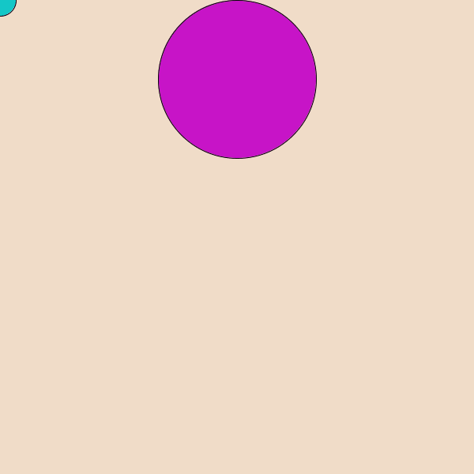
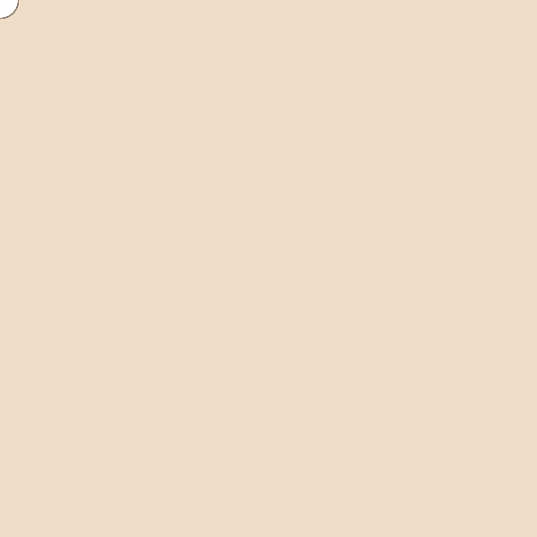
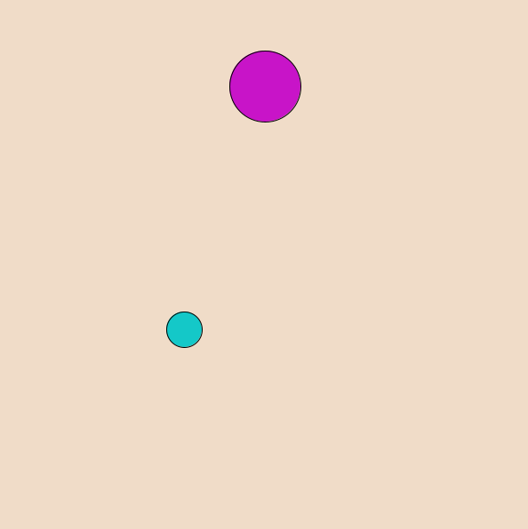
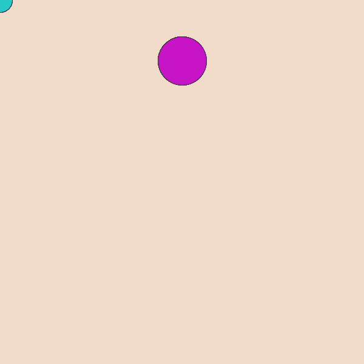

<<<<<<< HEAD
# Game 1:単発避けゲー

次のようなゲームを作ります．
マウスで水色の円を動かして，紫色の円から逃げるゲームです．


## 基本

まず，マウスを追従する自機(円)を描きます．
背景色や大きさは適当に設定してください．



```java
void setup(){
  size(600,600);
}

void draw(){
  background(240,220,200);//背景
  ellipse(mouseX,mouseY,40,40);//自機
}
```
このプログラムでもいいのですが，後で衝突判定などを行いたいときに，自機の現在地や大きさが欲しくなるかもしれません．そこで，次のように書き直します．

```java
void setup(){
  size(600,600);
}

void draw(){
  background(240,220,200);//背景
  int px=mouseX,py=mouseY,pr=20;
  ellipse(px,py,pr*2,pr*2);//自機
}
```

次に敵(円)を描きます．敵は，動かすことが前提なので，座標や半径を変数として取っておきます．

```java
int ex=300,ey=100,er=40;//敵の座標，半径

void setup(){
  size(600,600);
  gifset();
}

void draw(){
  background(240,220,200);//背景

  int px=mouseX,py=mouseY,pr=20;
  fill(20,200,200);
  ellipse(px,py,pr*2,pr*2);//自機
  
  fill(200,20,200);
  ellipse(ex,ey,er*2,er*2);//敵
  
  gifdraw();
}
```

さて，この状態では自機が敵に衝突しても何も起こりません．当たり判定を付けましょう．
2つの円の座標と半径がそれぞれ与えられたときに，円同士が重なっているかどうかを判定できれば良いです．

2つの円が重なっているときは，次のことが成り立ちます．
- `2つの円の半径の和>2つの円の中心同士の距離`

よって，これをif文で実装すれば良いです．

```java
float distance = sqrt((px-ex)*(px-ex)+(py-ey)*(py-ey));//三平方の定理で，中心同士の距離を求める
if(distance > pr+er){
//当たった判定
}
```

別の実装方法も考えられます．
```java
int dx = px - ex;
int dy = py - ey;
int sr = pr + er;
if( dx*dx + dy*dy < sr*sr ){
//当たった判定
}
```
肝心の，当たったときの処理ですが，とりあえず`stop();`関数を入れておきましょう．`stop()`関数はウィンドウの状態を維持したまま`draw()`関数の実行が止まります．

## 文字の描画
このままでは，敵に当たると急に動かなくなるので，ユーザーは困惑するでしょう．「GAMEOVER」の文字くらいは欲しいですね．

Processingには，文字を描画する関数が用意されています．

```java
textAlign(LEFT,TOP);
textSize(128);
text("GAMEOVER", 00, 00);
```
`text(S,x,y)`は文字列`S`を`(x,y)`を基準に描く関数です．
`textSize()`関数と`textAlign()`関数は`text()`関数で描かれる文字の大きさや基準点を指定しています．
詳しく知りたい人は調べてみてください．

文字の色は`fill()`で設定できます．



## 敵を動かす
敵を動かせば一応ゲームとして遊べるようになります．
敵の座標は`ex,ey`の変数で管理しているので，これを変えてやれば良いです．

敵の動かし方ですが，
[プログラミング入門/動きを作ろう](../Processing/chapter_03.md)
[プログラミング入門/分岐処理](../Processing/chapter_04.md)
を参考にして作ってみてください．

## 最終的なプログラム(一例)

<details><summary>プログラム</summary><div>

```java
int ex=300,ey=100,er=100;
int vx=20,vy=10;

void setup(){
  size(600,600);
}

void draw(){
  background(240,220,200);//背景


  int px=mouseX,py=mouseY,pr=20;
  fill(20,200,200);
  ellipse(px,py,pr*2,pr*2);//自機
  
  fill(200,20,200);
  ellipse(ex,ey,er*2,er*2);//敵
  
  int dx = px - ex;
  int dy = py - ey;
  int sr = pr + er;
  if( dx*dx + dy*dy < sr*sr ){
    textAlign(LEFT,TOP);
    textSize(128);
    fill(255,0,0);
    text("GAMEOVER", 00, 00);
    stop();
  }
  ex+=vx;
  ey+=vy;
  if(ex>=600||ex<0){
    vx=-vx;
  }
  if(ey>=600||ey<0){
    vy=-vy;
  }
  
}
```
</div></details>

## さらにゲームらしく
このゲームに付け加える要素として次のようなものが考えられます．
- 避けた続けた時間をスコアとしてゲームオーバー時に表示させる
- 敵のスピードがだんだん早くなるようにする
- ゲームオーバーになったあとにリトライできるようにする
=======
# Chpater 1:設計を考えよう

## ゲームの構想を練る
完成したゲームがこちらになります．


実際にゲームを作るときにも，ゲーム画面がどんな感じであるかを想像できなければ，プログラミングができません．ということで，上のgif画像のゲームを想像してたとしましょう．これは対戦型ゲームで，p●ngというゲームのパクリです．（上のgif画像でイメージが沸かない場合は調べてみましょう．）

さて，構成を見ていきましょう．このゲームは，
- ボール
- バーが二つ
の図形でできています．
そして，これらがどう動くかを考えます．
書き出してみると，
- バーは十字キーで操作をする
- ボールを一定の方向に動かす
- ボールが壁に当たったら跳ね返る
- ボールがバーに当たったら跳ね返る
- バーを過ぎたら終了
といったところでしょうか．
あとはそれぞれをどう処理するかを考えます．

# 工事中
>>>>>>> b20bcb7dd3a1ff641b1f60ef110d0bbe84e187f8
