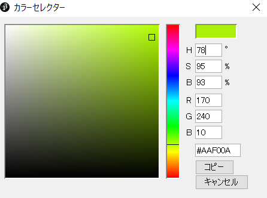

# コンピュータ上での色の表現

## 色の指定
Processingではfill命令やstroke命令で描画する色をしてすることができます．(r,g,b)はred,green,blueの光の三原色の混じり具合を表しています．それぞれ0~255の整数値で設定できます．

絵具とは違い，光であるので色が混じると白色に近くなっていきます．次の表に示します．

| (r,g,b) | 色 | 
| :- | :- |
| ```(000,000,000)```| 黒 |
| ```(255,255,255)```| 白 |
| ```(255,000,000)```| 赤 |
| ```(000,255,000)```| 緑 |
| ```(000,000,255)```| 青 |
| ```(255,255,000)```| 黄 |
| ```(255,000,255)```| 紫 |
| ```(000,255,255)```| 水 |

デザインの話になりますが，上の表にあるような極端に振った(255とか0)値を含んだ色を使うと，主張が激しく感じます(個人差はありますが)．意図的にそうしたい場合を除いて，実際に色を使う場合は，そのような色を避けて優しい色遣いをするとよいです．

また，上の表は覚える必要はなく，Processingのツールタブから色選択...を選択すると下の画像のようなウィンドウが出てきます．



これを使えば使いたい色のrgb値がわかります．