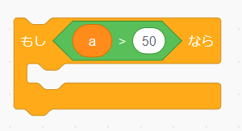
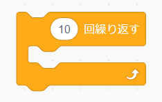
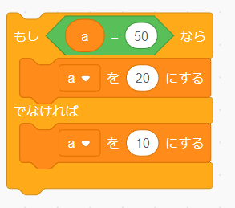
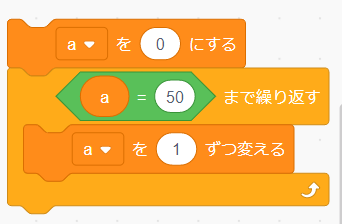
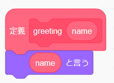

# Scratchの命令に置き換えると？

| ブロック | Processing | 
| :- | :- |
|  | `if(a>50){}` |
|  | `for(int i=0;i<10;i++){}` |
|  | `50<a && a<100` |
|  | `if(a==50){}else{}` |
|  | `a=0;while(!a==50){a=a+1;}` |
|  | `void greeting(string name){print(name);}` |
