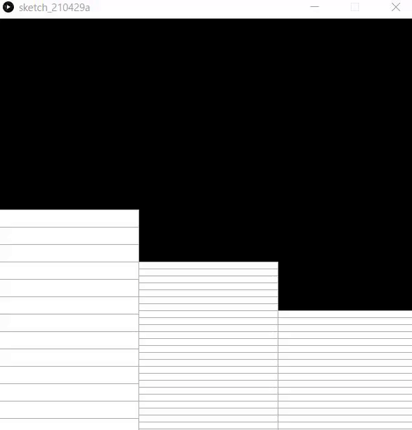
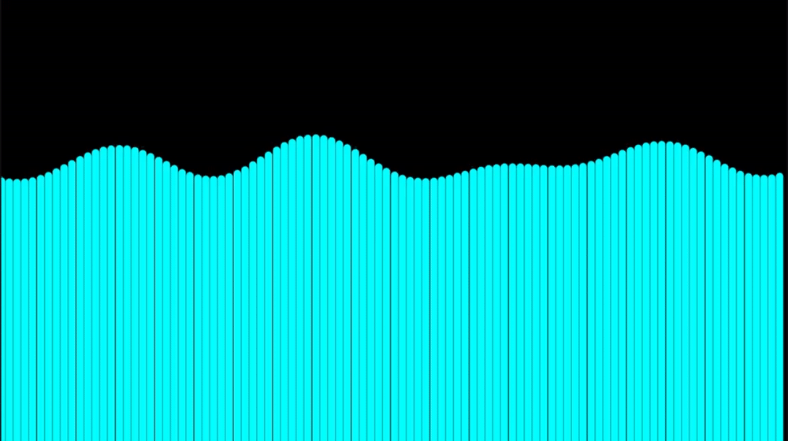
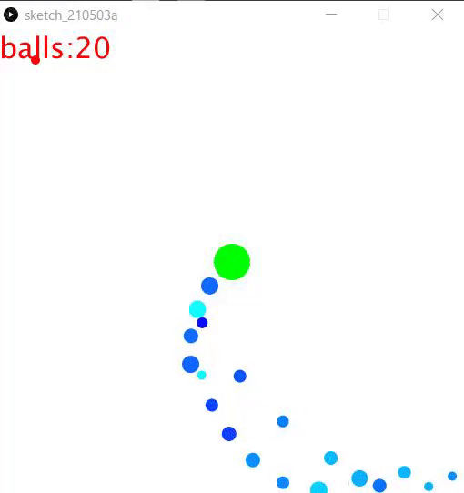
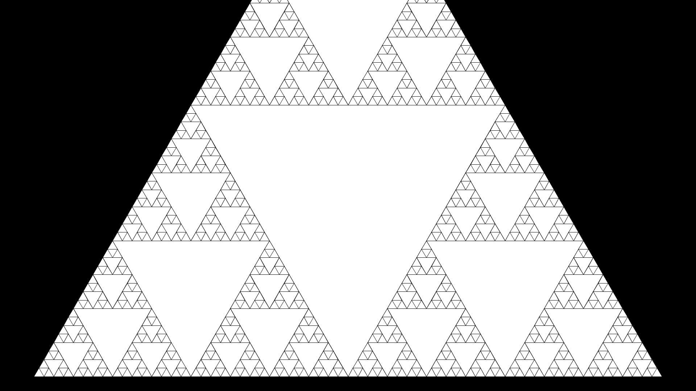
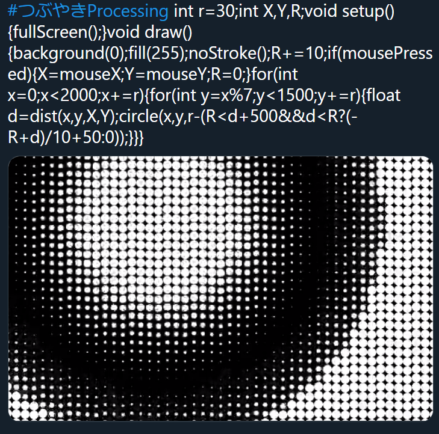

# サンプルプログラム

全てShibaken28によって書かれました．一部コードの可読性が著しく低いものがあります．

## 時計



<details><summary>ソースコード</summary><div>

```java
void setup(){
  size(600,600);
}

void draw(){
  fill(0);
  rect(0,0,width,height);
  int hy=height/24;
  int my=height/60;
  int sy=height/60;
  stroke(170);
  fill(255);//白色
  for(int i=1;i<=hour();i++)rect(0,600-hy*i,200,hy);
  for(int i=1;i<=minute();i++)rect(200,600-my*i,200,my);
  for(int i=1;i<=second();i++)rect(400,600-sy*i,200,sy);
}
```
</div></details>

## 歪み


<details><summary>ソースコード</summary><div>

```java
int r=40;
void setup(){fullScreen();}
void draw(){
  clear();noStroke();
  float X=mouseX,Y=mouseY;
  for(int x=0;x<=width;x+=r){
    for(int y=0;y<=height;y+=r){
      float tx=x,ty=y,d=PI/2;
      float dx=X-x,dy=Y-y;
      float l=sqrt(dx*dx+dy*dy);
      if(X-x!=0)d=atan(dy/dx);
      else if(Y>y)d=-d;
      if(X-x>0)d=d-PI;
      
      tx+=cos(d)*r*log(l);ty+=sin(d)*r*log(l);
      circle(tx,ty,r);
    }
  }
}
```
</div></details>


## 波


<details><summary>ソースコード</summary><div>

```java
int w=100;
float wave[]=new float[w];
float y=400;
float t=0;
float x;

void setup(){
  fullScreen();
  x=displayWidth;
}

void draw(){
  float ww=x/w;
  background(0);
  strokeWeight(ww-1);
  stroke(0,255,255);
  for(int i=0;i<w;i++){
    wave[i]=0;
    float T=120,la=630;
    float A=25;
    wave[i]+=A*sin(2*PI*(t/T-i*ww/la));
    T=70;la=450;
    A=30;
    wave[i]+=A*sin(2*PI*(t/T-i*ww/la));
    T=-200;la=1050;
    A=20;
    wave[i]+=A*sin(2*PI*(t/T-i*ww/la));
    line(i*ww,wave[i]+y,i*ww,displayHeight);
  }
  t++;
}
```

</div></details>


## 波動


<details><summary>ソースコード</summary><div>

```java
int r=30;
int X, Y, R;
void setup() {
  fullScreen();
}
void draw() {
  background(0);
  fill(255);
  noStroke();
  R+=10;
  if (mousePressed) {
    X=mouseX;
    Y=mouseY;
    R=0;
  }
  for (int x=0; x<2000; x+=r) {
    for (int y=x%7; y<1500; y+=r) {
      float d=dist(x, y, X, Y);
      circle(x, y, r-(R<d+500&&d<R?(-R+d)/10+50:0));
    }
  }
}
```
</div></details>


## 弾幕避け

<details><summary>ソースコード</summary><div>

```java
class Point{
  float x;
  float y;
  float d;
  float s;
  float far;
  float r;
  int t_f=1;
  color col;
  Point(float p,float q,float t,float v,float h,color c)
  {
    x=p;
    y=q;
    d=t;
    s=v;
    r=h;
    col=c;
  }
  
  void go(float p,float q,float t,float v,float h)
  {
    x=p;
    y=q;
    d=t;
    s=v;
    r=h;
  }
  
  void move()
  {
    if(s!=0){
      x=x+cos(radians(d))*s;
      y=y+sin(radians(d))*s;
    }
  }
  
  void hit()
 {
   if(time>10)
   {
     far=sqrt((mouseX-x)*(mouseX-x)+(mouseY-y)*(mouseY-y));
     if(far<5){t_f=0;}else{t_f=1;}
   }
 }
 
 void away()
 {
   if(x>width){d=180-d;}
   else if(x<0){d=180-d;}
   else if(y>height){d=-d;}
   else if(y<0){d=-d;}
 }
  
}

Point[] zahyo=new Point[512];
int use_n=0;
int rad=0;
int level=1;
float time=0; 
float speed=3;
int hankei=10;
int ran=0;

void setup()
{
  size(512,512);
  background(200);
  noStroke();
  for(int i=0; i<zahyo.length ;i++)
  {
    zahyo[i]=new Point(-64,-64,0,0,-1,color(i,random(255),255));
  }
  run();
}

void draw()
{
  fill(255,255,255);
  rect(0,0,width,height);
  fill(0,0,0);
  for(int i=0; i<zahyo.length ;i++)
  {
    fill(zahyo[i].col);
    zahyo[i].move();
    zahyo[i].away();
    ellipse(zahyo[i].x,zahyo[i].y,zahyo[i].r,zahyo[i].r);
  }
  fill(0,255,0);
  ellipse(width/2,height/2,40,40);
  fill(255,0,0);
  ellipse(mouseX,mouseY,10,10);
  for(int i=0; i<zahyo.length ;i++)
  {
    zahyo[i].hit();
    if(zahyo[i].t_f==0)
    {
      noLoop();
      textSize(64);
      text("GAME OVER", 0, 300);
    }
  }
  time += 1;
  textSize(32);
  text("balls:"+level, 00, 32);
  if (time/(20-level/15)==int(time/(20-level/15)))
  {
    level+=1;
    run();
  }
}

void incuse()
{
  zahyo[use_n].go(width/2,height/2,rad,speed,hankei);
  use_n += 1;
  if (use_n>=zahyo.length){use_n=0;}
}

void run()
{
  speed=1.5;
  hankei=10+int(random(0,10));
  rad+=7;
  zahyo[use_n].go(width/2,height/2,rad,speed,hankei);
  incuse();
}
```
</div></details>


## カージオイド

<details><summary>ソースコード</summary><div>

```java
float t=0,x,y;
void setup(){fullScreen();x=displayWidth/2;y=displayHeight/2;}
void draw(){
clear();stroke(255);strokeWeight(3);
for(float i=0;i<6.28;i+=.0523){
float r=200*(1+cos(i)*sin(t)*2),s=200*(1+cos(i+.0523)*sin(t)*2);
for(float j=0;j<6.28;j+=0.419)line(x+r*cos(i+j),y+r*sin(i+j),x+s*cos(i+.0523+j),y+s*sin(i+.0523+j));
}t+=.03;
}
```
</div></details>

## フラクタル

<details><summary>ソースコード</summary><div>

```java
float t=1;
int cnt=0;
void setup(){
  fullScreen();
}

void d(float cx,float cy,float s,int c,float rd){
  cnt++;
  int r=255,g=255,b=255;
  fill(r,g,b);
  float x1=cx+cos(0+rd)*s,y1=cy+sin(0+rd)*s;
  float x2=cx+cos(PI*2/3+rd)*s,y2=cy+sin(PI*2/3+rd)*s;
  float x3=cx+cos(PI*4/3+rd)*s,y3=cy+sin(PI*4/3+rd)*s;
  triangle(x1,y1,x2,y2,x3,y3);
  
  s/=2;
  x1=cx+cos(0+rd)*s;y1=cy+sin(0+rd)*s;
  x2=cx+cos(PI*2/3+rd)*s;y2=cy+sin(PI*2/3+rd)*s;
  x3=cx+cos(PI*4/3+rd)*s;y3=cy+sin(PI*4/3+rd)*s;
  if(c>0){
    //d(cx,cy,s,c-1,rd);
    d(x1,y1,s,c-1,rd);
    d(x2,y2,s,c-1,rd);
    d(x3,y3,s,c-1,rd);
  }
}

void draw(){
  cnt=0;
  textSize(100);
  background(0);
  fill(255);
  d(displayWidth/2,displayHeight/2,1000,6,PI/6);
  t=PI/3;
}
```
</div></details>


<<<<<<< HEAD


=======
>>>>>>> b20bcb7dd3a1ff641b1f60ef110d0bbe84e187f8
## ほかの作品
### OpenProcessing
[OpenProcessing](https://openprocessing.org/)というサイトにはProcessingを使用した作品が投稿されています

<<<<<<< HEAD
### つぶやきProcessing



一つのツイートに収まるソースコードで作品を作る，#つぶやきProcessing というハッシュタグが存在します．ハッシュタグを検索すれば作品がたくさん出てきます．また，ハッシュタグさえ付ければ誰でも投稿が可能なので挑戦してみるのも良いでしょう．

次のプログラムはつぶやきProcessingの例です．
```java
float t,e,i,j;void setup(){size(900,600);}void draw(){t+=.017;e+=.1;clear();noStroke();for(i=0;i<32;i++)for(j=1;j<5;j++){float d=1-j/25,c=i*0.196+t*(2+j/3);float x=cos(c)*100*j,y=sin(c)*100*j;ellipse(450+x*cos(e/j)+y*sin(d)*sin(e/j),300+y*cos(d),10*j,10*j);}}
```
[ツイート例](https://twitter.com/Shibak3333n/status/1418192071987400713)

このような数式などを使った幾何学的な作品はジェネラティブアート(Generative Art)と呼びます．Processingはジェネラティブアートをするのに手軽な言語です．

=======

### #つぶやきProcessing


[つぶやきProcessingの例](https://twitter.com/Shibaken_8128/status/1245299092135088129)


一つのツイートに収まるソースコードで作品を作る，#つぶやきProcessing というハッシュタグが存在します．ハッシュタグを検索すれば作品がたくさん出てきます．また，ハッシュタグさえ付ければ誰でも投稿が可能なので挑戦してみるのも良いでしょう．
>>>>>>> b20bcb7dd3a1ff641b1f60ef110d0bbe84e187f8
