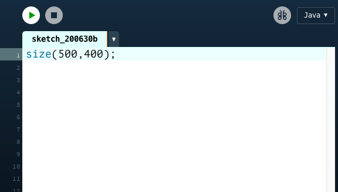
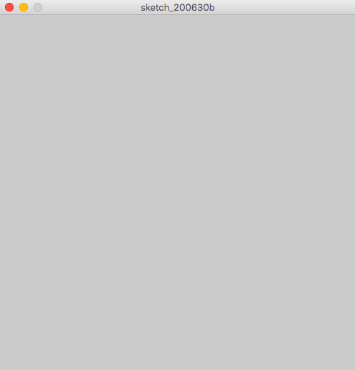
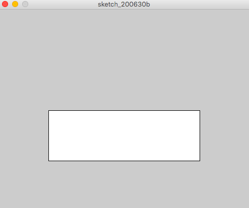
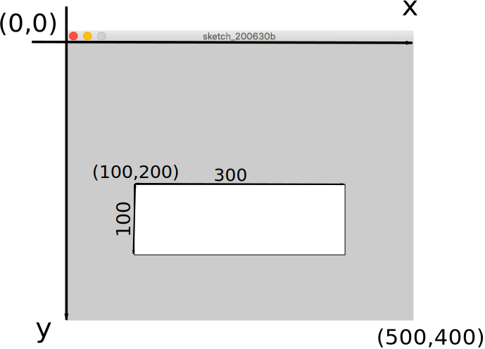

# 関数を使ってみる
## 実際に使ってみる

### コードを書いてみよう 
次のコードを入力してみましょう．最後のセミコロン;を忘れずに．

```java
size(500,400);
```




### 実行しよう
ウィンドウの三角形の再生マークのボタンがありますね．クリックすると実行されます．新しく画面(ウィンドウ)が表示されました．



- 実行ボタンを押してもウィンドウが表示されなかったらもう一度コードを確認してみよう．どこかが間違っているはず．


### 数字を変えてみよう
```java
size(500,400);
```
の(500,400)と入力したところを別の数字にしてみましょう．

例えば
```java
size(600,100);
```
と入力して，実行をすると


横長になりました．

さて，お気づきの方もいるかもしれませんがこの```size(数字,数字);```というのは画面のサイズを指定しています．厳密には，```size(x,y);```というコードは画面の横の長さをx，縦の長さをyにする，という意味を持っています．

### コードを書いてみようその2
次のコードを入力してみましょう．入力し終わったら，実行ボタンを押して実行しましょう．

```java
size(500,400);
rect(100,200,300,100);
```

次のような画面が表示されます．



画面内に白い長方形が描かれました．数字をいろいろ変えて，この数が何を意味するのかを考えてみてください．


### rectの正体
```rect(a,b,c,d)```を実行すると座標(a,b)を左上とする，横の長さc，縦の長さdの長方形が描かれます．



ここでの座標というのは数学でもでてきた平面での場所を表す数字です．上の図のように，画面の左上を原点としProcessingの世界では，xは右方向が正，yは下方向が正，と決まっています．y座標が下に行くほど増えていくところに注意です．
- Processing(コンピューター)に対して「画面描いて！」とか「正方形描いて！」みたいに命令しているので，しばしば「命令」と呼びます．


### 練習
#### 演習2-1
>横600,縦300のウィンドウに，左上の座標が(100,50)で横の長さが200,縦の長さが100の長方形を描け．
#### 演習2-2
>横450,縦600のウィンドウに，左上の座標が(100,100)で右下の座標が(400,400)の正方形を描け．


#### 解答例
<details><summary>解答例:コードを書いてから答えをみよう！</summary><div>
演習2-1

```java:演習2-1
size(600,300);
rect(100,50,200,100);
```
演習2-2：```rect(a,b,c,d)```のc,dは座標ではなく辺の長さです．辺の長さは400-100=300なので，cとdは300にする必要があります．

```java:演習2-2
size(450,600);
rect(100,100,300,300);
```
</div></details>


## Processingの関数
### 関数とは
さきほど，```size()```や```rect()```といったものを使ってきましたが，これらを関数と呼びます．
表にまとめてありますが，関数を覚える必要はありません．なぜなら，リファレンスをみればわかるからです．

| 関数名 | 起こること | 
| :- | :- |
| ```point(x,y)```| 座標(x,y)に点をうつ |
| ```line(x1,y1,x2,y2)``` | 座標(x1,y1)と座標(x2,y2)が両端の線分を描く |
| ```ellipse(x,y,a,b)``` | 座標(x,y)を中心に横軸がa，縦軸がbの楕円を描く[^1] |
| ```triangle(x1,y1,x2,y2,x3,y3)``` | (x1,y1) と (x2,y2) と (x3,y3) をつなぐ三角形を描く|

[^1]:aとbを同じ数cにすれば直径がcの円が描けます．例えばellipse(10,10,7,7)は中心(10,10)直径7の円を描きます．

### 練習

#### 演習2-3
>[ 演習2-2 ]( #演習2-2 )のコードに書き足して，演習2-2で描いた正方形の内側にぴったり接する円を描け．

#### 解答例
<details><summary>解答例</summary><div>
演習2-3：正方形の真ん中の座標は(250,250)で，一辺が300なので，中心(250,250)直径300の円を描けば良い

```java:演習2-3
size(450,600);
rect(100,100,300,300);
ellipse(250,250,300,300);
```
</div></details>