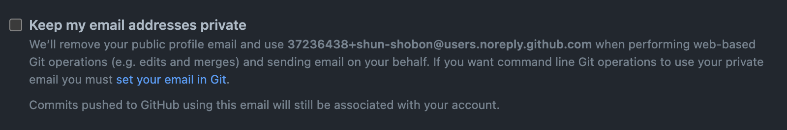

# Git / GitHub を始める準備

## Gitのインストール

### Windows･WSL2共通

[こちらのリンク](https://git-scm.com/download/win)からインストーラをダウンロードし、インストーラを実行して画面の指示に従ってください。
なお、途中で使用するテキストエディタを選択する場面がありますが、 **デフォルトではVimが選択されているため** 、別のエディタを選択してください。
(VimはCLI上で動作するテキストエディタですが、扱いが非常に難しいため初心者にはおすすめしません。)おすすめはVSCode(入っていれば)です。

### Ubuntu(WSL2)の場合

以下のコマンド実行でインストールできます。
(余談ですがLinuxは1コマンドで何でもインストールすることができるのが強みです。)

```shell
sudo apt update
sudo apt install git
```

GitではGitHubなどのリモートGitサーバーの認証情報を扱う場面がありますが、WSL上のGitではそれを保持することができないため、
WindowsにインストールしたGit for Windowsを用いて認証情報を保存します。以下のコマンドで設定してください。
(なお、以下の設定はデフォルトのパスにGit for Windowsをインストールした場合のコマンドです。変更した場合は適宜読み替えてください。)

```shell
git config --global credential.helper "/mnt/c/Program\ Files/Git/mingw64/libexec/git-core/git-credential-manager.exe"
```

### macOSの場合

App StoreからXCodeをイントールすれば勝手についてきます。
しかし、ついてくるものはバージョンが古いためHomebrewからインストールしましょう。

```shell
brew update
brew install git
```


## GitHubのアカウント登録

[ここから](https://github.com/join)GitHubのアカウント登録を行ってください。
(GitHubは利用規約で複数アカウントの所持が禁止されているため解説できません。申し訳ありません。)


## 名前とメールアドレスの設定

Gitで使用する名前とメールアドレスを設定します。
名前はお好きに決めて構いませんが、メールアドレスはGitHubに登録したものを使用する必要があります。
この名前とメールアドレスは全世界に公開されます(GitHubにデータを上げる場合)。
もしも自分のメールアドレスが晒されるのが嫌だと言う場合は、[GitHubの設定のEmailsタブ](https://github.com/settings/emails)にあるメールアドレスを使用してください。



ターミナル上で以下のコマンド実行します。

```shell
git config --global user.name <名前>
git config --global user.email <メールアドレス>
```
