# Gitの概要

## Gitの仕組み

Gitはバージョン管理システムだと言いましたが、Gitどのようにバージョンを管理しているのでしょうか。
Gitは **スナップショット(Snapshot)** を取ることによってバージョンを管理しています。

Gitにバージョンを記録するとき、その時点での全てのファイルの状態のスナップショットを撮ります。
そしてバージョンとしてそのスナップショットへの参照を記録します。
もしすでにスナップショットが撮られていて、変更がないファイルの場合はスナップショットは撮らずに過去のスナップショットを使いまします。

**つまりGitはバージョンごとのファイルのデータを全て記録しています。**
そのため過去のバージョンのファイルを表示する時、Gitは過去のバージョンに記録されているスナップショットの参照からファイルデータを表示しているだけなのです。

## Gitは永続的

Gitは基本的にデータを追加していくだけです。
データの削除は行われず、一度記録されたデータは永久的に残ります。[^1]
これは試行錯誤を安全に行えるため、Git(バージョン管理システム)の利点となります。
**しかし、何かしらの機密情報(パスワードやトークンなど)を間違えて記録してしまうと削除が非常に難しくなります。**
Git/GitHubを利用する際はその点に留意して利用してください。

## リポジトリ

Gitのバージョン管理は **リポジトリ(Repository)** という単位で行われます。
ファイルの変更履歴などの情報は全てリポジトリに記録されます。

リポジトリの実態は`.git`というディレクトリです。
Gitの管理下(=リポジトリの管理下)にあるディレクトリにはこの`.git`というディレクトリが存在します。

**この`.git`にはリポジトリのあらゆるデータが格納されているため、これを削除してしまうとリポジトリも消えてしまいます。
注意しましょう。**

## ローカルリポジトリとリモートリポジトリ

Gitは複数人での共同管理に対応しています。
この共同管理は1つのデータを複数のリポジトリで共有することで実現しています。
リポジトリは **ローカルリポジトリ** と **リモートリポジトリ** の2種類に分類できます。

ローカルリポジトリは自分のPC上に置いておくリポジトリで、共同管理者一人ひとりがPC上に配置します。
対してリモートリポジトリはサーバ等の複数人でアクセスできる環境に置かれ、このリモートリポジトリを介して共同管理者はリポジトリのデータをやり取りします。

また、ローカルリポジトリのデータをリモートリポジトリにアップロードすることを **プッシュ(Push)** 、リモートリポジトリのデータをローカルリポジトリにダウンロードすることを **フェッチ(Fetch)** と言います。
詳しくは後述しますが、覚えておきましょう。

## コミット

ファイルデータのスナップショットを撮って、バージョンを記録することを **コミット(Commit)** と言います。
この表現は非常に多く出てくるので覚えておきましょう。

## Gitにおける3つの場所

リポジトリには3つの場所が存在します。
それは **作業ディレクトリ(Working Directory)** 、 **ステージングエリア(Staging Area)** 、 **`.git`ディレクトリ(リポジトリ)** です。
**作業ディレクトリ** は現在ディスク上に存在するファイルのことで、実際に作業しているディレクトリを指します。
**ステージングエリア** はコミットの準備をするための場所で、ここに置いたファイルがコミットに含まれます。
**`.git`ディレクトリ** はコミットしたバージョンが含まれます。

---

[^1]: 特殊な管理コマンドを使用したり、ガベージコレクションといった操作を行うと、データが削除されることがあります。
