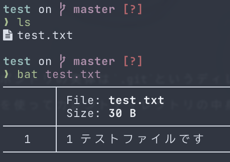
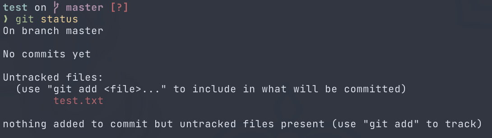

# 初めてのコミット

早速Gitでコミットをしてみましょう。


## リポジトリを作る

とりあえず作業用に適当なリポジトリを作ってみます。
Windowsを使用している場合はGit Bashを、それ以外を使用している場合は普段使用しているターミナル[^1]を開きましょう。
表示されるのは俗に言う「黒い画面」です。もしかしたらこの黒い画面に恐怖心がある方もいるかも知れませんが、頑張ってください。


上記のスクリーンショットは若干違う表示の場合もあると思いますが、基本的に`>`や`$`みたいな表示があり、
そこにテキスト(コマンド)を入力することができるようになっているはずです。

コマンドを入力する準備ができたら、リポジトリとして作業するためのディレクトリを作ります。
名前は何でも良いですが、ここでは`test`とします。

```shell
mkdir test
```

ディレクトリを作ったらカレントディレクトリをそこに移動します。

```shell
cd test
```

移動したらリポジトリを作ってみましょう。
Gitのコマンドは全て`git <サブコマンド名>`というような形式で、
リポジトリを作る場合は`git init`というコマンドを使用します。
`init`は **Initialize** の略で、初期化といった意味があります。
ITの世界では頻繁に使用される略語のため、覚えとくと良いです。

```shell
git init
```

リポジトリの作成に成功すると、
`Initialized empty Git repository in <カレントディレクトリ>/.git/`
というメッセージが出力されるはずです。

[前回のリポジトリの説明](02_git_summary.html#リポジトリ)で書いたとおり、リポジトリの実体は`.git`というディレクトリです。
`git init`はこの`.git`ディレクトリを作成するコマンドです。
そのため、ディレクトリにあるファイル・ディレクトリを表示させる`ls`コマンドを使ってカレントディレクトリの中身を表示すると、`.git`が新たに作成されています。


## 新しくファイルを作ってみる

リポジトリが作成できたら、そこに何かファイルを作ってみましょう。
エクスプローラーやFinderなどのファイルマネージャーから「新規作成」で作ってもいいですし、
VSCodeなどのテキストエディタで作ってもいいですし、
`touch`コマンドとリダイレクトを駆使して作っても構いません。とにかく何かしらファイルを作ります。
ただしできる限りテキストファイルにしてください。Wordファイルや画像ファイルはGitで管理するにはあまり都合がよくありません。[^2]



これで作業ディレクトリにファイルが新しく追加されました。
Gitは作業ディレクトリ上での変更をきちんと認識しています。
現在のリポジトリの状態を見るには`git status`というコマンドを使用します。



一段落目は今どのブランチ(branch)に居るかの説明です。ブランチの解説は後でしますが、おそらく`master`か`main`になっていると思います。

二段落目はこのリポジトリにはまだコミットがされていないことを表しています。

三段落目が重要です。ここでは作業ディレクトリやステージングエリアにあるファイルの状態を表示しています。
今は`Untracked`なファイルとして`test.txt`が表示されています。
`Untracked`なファイルはまだGitで管理されていないファイルのことです。
`test.txt`は作成したばかりで、コミット等も一度も行っていないため`Untracked`なファイルとなっています。

四段落目ではコミットすべきファイルはないが(ステージングエリアにまだファイルを追加していないため)、`Untracked`なファイルが存在していることを表しています。
