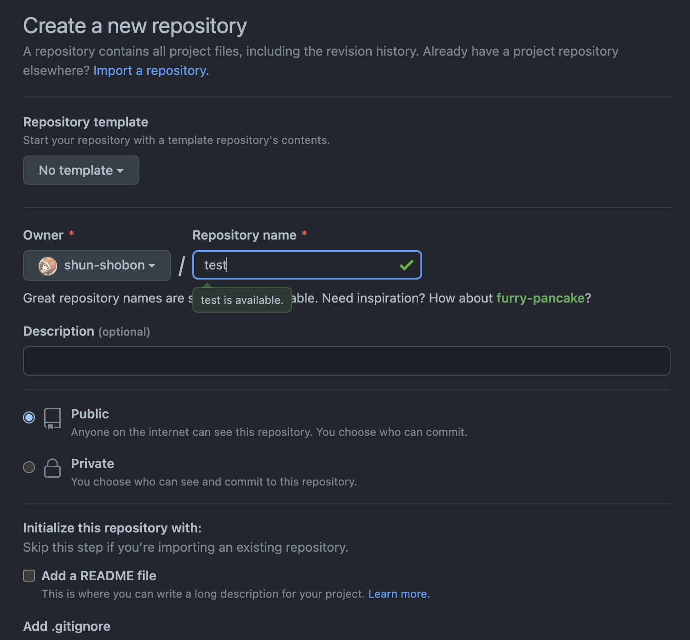
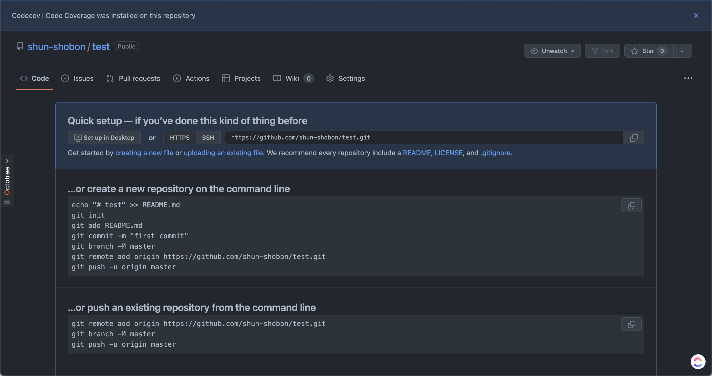

# 初めてのプッシュ

[前回](03_first_git_commit.html)はGitでのリポジトリの作成とコミットまでを行いました。
ここまででローカル(自分のPC)上でGitを運用することができるようになりました。
しかし、Gitはインターネット等を介したリモートリポジトリを使うことによって真価を発揮します。
ローカル上で作業した結果をリモートにアップロードすることによって他の人に自分の成果を簡単に共有したり、ローカル上のデータが飛んだときのバックアップにすることもできます。
ここではGitHubを用いてリポジトリを作り、プッシュするところまでを行います。

## リポジトリを作る

ローカルで最初に作業したのと同じようにリモートでも最初にリポジトリを作成するところから始めます。
[このリンク](https://repo.new)か`github.com`にアクセスし、右上の「+」ボタンから「New repository」を選択して新規リポジトリ作成画面を開きましょう。

入力欄がたくさんありますが、必要なのは「Repository name」のみです。
ここでリポジトリ名を決めましょう。
名前は好きなように設定可能ですが、
リポジトリ名がそのままURLになるためむやみに変更したり、
あまり関係のない名前を付けるのはやめましょう。
なお、リポジトリ名として使えるのは半角英数字とハイフン(`-`)とアンダースコア(`_`)のみです。
リポジトリ名を決めたら後は特に変更せずに一番下の「Create repository」をクリックしてリポジトリを作成します。[^1]

「Quick setup」の下にある`https://`から始まるURLを確認してください。このURLは今作成したリポジトリへのURLです。`https://`から始まっていない場合はその左のHTTPS/SSHのボタンからHTTPSを選択してください。[^2]
このURLは後で使用するので右のボタンからコピーしておきましょう。

---

[^1]: リポジトリ名の下のPublic/Privateは他人からのリポジトリの見え方を選択する部分です。Publicにすると全世界に公開されますし、Privateは自分(と招待した人)しか見ることが出来ません。

[^2]: SSHでもプッシュは可能ですが、少しセットアップが面倒です。詳しくは調べてみてください。
