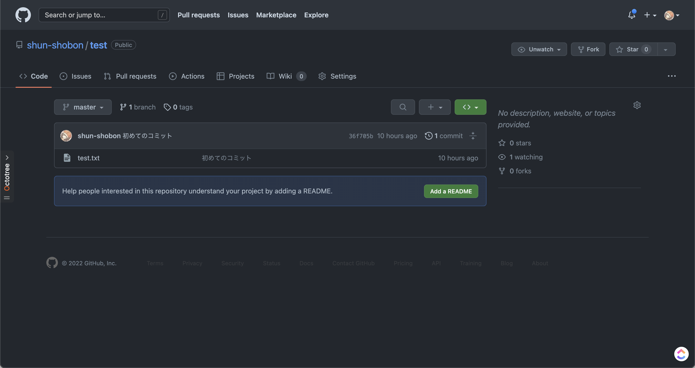

# 初めてのプッシュ

[前回](03_first_git_commit.html)はGitでのリポジトリの作成とコミットまでを行いました。
ここまででローカル(自分のPC)上でGitを運用することができるようになりました。
しかし、Gitはインターネット等を介したリモートリポジトリを使うことによって真価を発揮します。
ローカル上で作業した結果をリモートにアップロードすることによって他の人に自分の成果を簡単に共有したり、ローカル上のデータが飛んだときのバックアップにすることもできます。
ここではGitHubを用いてリポジトリを作り、プッシュするところまでを行います。


## リポジトリを作る

ローカルで最初に作業したのと同じようにリモートでも最初にリポジトリを作成するところから始めます。
[このリンク](https://repo.new)か`github.com`にアクセスし、右上の「+」ボタンから「New repository」を選択して新規リポジトリ作成画面を開きましょう。


入力欄がたくさんありますが、必要なのは「Repository name」のみです。
ここでリポジトリ名を決めましょう。
名前は好きなように設定可能ですが、
リポジトリ名がそのままURLになるためむやみに変更したり、
あまり関係のない名前を付けるのはやめましょう。
なお、リポジトリ名として使えるのは半角英数字とハイフン(`-`)とアンダースコア(`_`)のみです。
リポジトリ名を決めたら後は特に変更せずに一番下の「Create repository」をクリックしてリポジトリを作成します。[^1]


「Quick setup」の下にある`https://`から始まるURLを確認してください。このURLは今作成したリポジトリへのURLです。`https://`から始まっていない場合はその左のHTTPS/SSHのボタンからHTTPSを選択してください。[^2]
このURLは後で使用するので右のボタンからコピーしておきましょう。


# リモートリポジトリの追加

GitHub上にリポジトリが作成できたら、次はローカルリポジトリにリモートリポジトリの追加をしてみましょう。

リモートリポジトリ関連の設定は`git remote`というコマンドを使用します。
今回は新しくリモートリポジトリを追加するので`git remote add`というコマンドになります。

```shell
git remote add origin <リモートリポジトリへのURL>
```

リモートリポジトリには分かりやすいように名前を付けることが出来ます。`origin`はリモートリポジトリの名前です。好きな名前にすることが出来ますが、Gitでは大元になるリモートリポジトリ名を慣例的に`origin`にしています。[^3]

リモートリポジトリに名前を付けることができることから分かるように、リモートリポジトリは複数個登録することが可能です。しかし、1つか2つ程度のリモートリポジトリしか登録することはないでしょう。なぜなら1つのリモートリポジトリを大元として中央集権的なモデルにしたほうが管理がしやすいためです。

無事に追加ができたかどうかは`git remote show`で確認することが出来ます。`git remote show`で現在のリモートリポジトリの一覧が、`git remote show <リモートリポジトリ名>`でそのリモートリポジトリの詳細を確認することが出来ます。


# プッシュ

リモートリポジトリが登録できたらいよいよプッシュをしてみます。
プッシュを行うコマンドは文字通り`git push`です。

```shell
git push -u origin master
```

`origin`は先程のリモートリポジトリ名、`master`はブランチ名です。ブランチの解説は後に行うので、今は気にしないでください。
`-u`オプションは`--set-upstream`の略です。
これは上流ブランチと呼ばれるものを設定するオプションですが、少し難しい概念なため解説は割愛します。
気になる方は調べてみてください。

Git for Windowsを使用している場合はプッシュするとログインを求められる画面が表示されるはずなので、画面に従ってログインをしてください。
macOSやLinuxでGitを操作している場合はユーザ名とパスワードを求められます。
ユーザ名はGitHubのユーザ名を、パスワードには **パスワードではなく、Personal Access Tokenと呼ばれるトークン** を入力します。
詳しくは[このページ](https://docs.github.com/ja/authentication/keeping-your-account-and-data-secure/creating-a-personal-access-token)を参照してください。

無事にプッシュが出来たらGitHubのリポジトリへアクセス(またはページの更新)をしてみましょう。成功していれば先程と異なる画面が表示されるはずです！



GitHubのリポジトリ画面ではコミット履歴や各コミットでの変更点、ファイルの閲覧をすることが出来ます。色々触ってみて遊んでみてください！

---

[^1]: リポジトリ名の下のPublic/Privateは他人からのリポジトリの見え方を選択する部分です。Publicにすると全世界に公開されますし、Privateは自分(と招待した人)しか見ることが出来ません。

[^2]: SSHでもプッシュは可能ですが、少しセットアップが面倒です。詳しくは調べてみてください。

[^3]: `origin`には起源や原点や由来といった意味があります。
