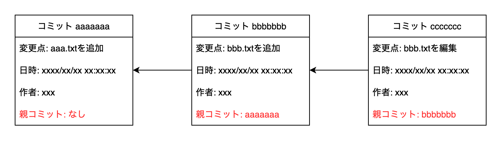
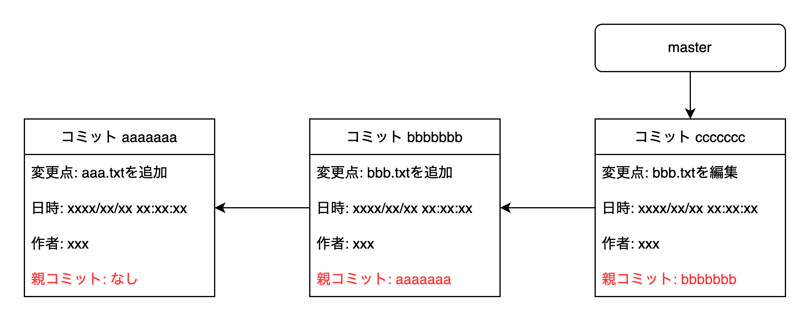
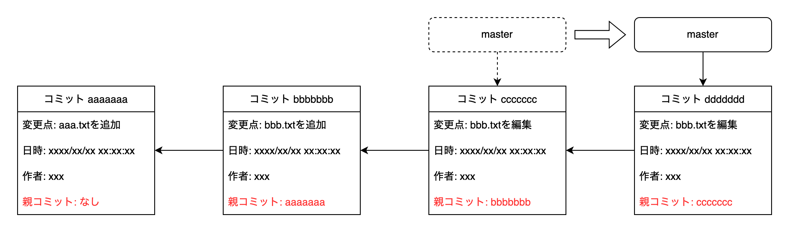
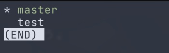
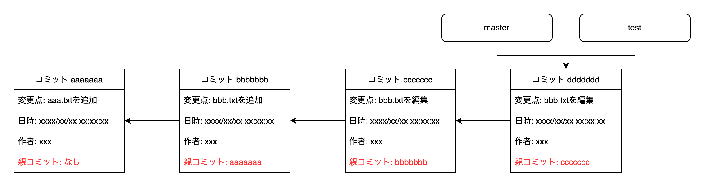
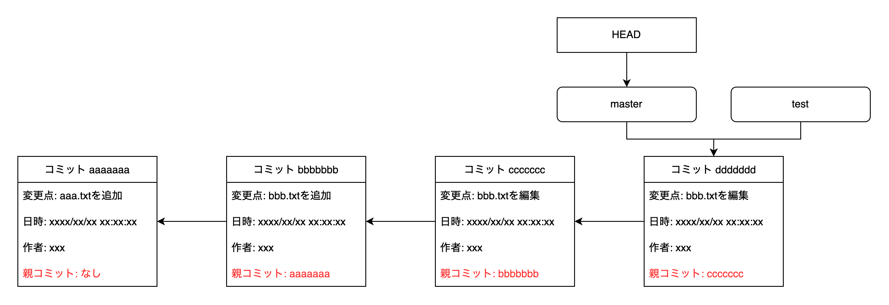
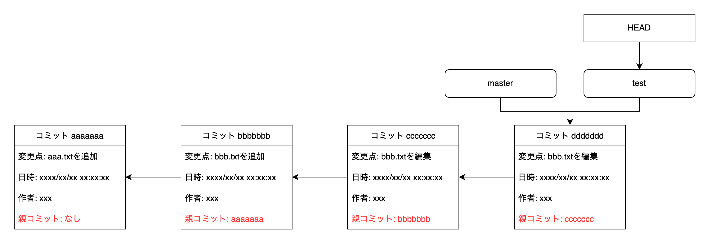
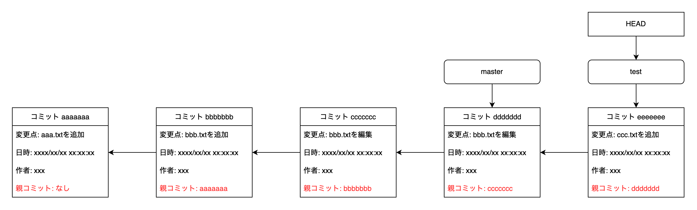
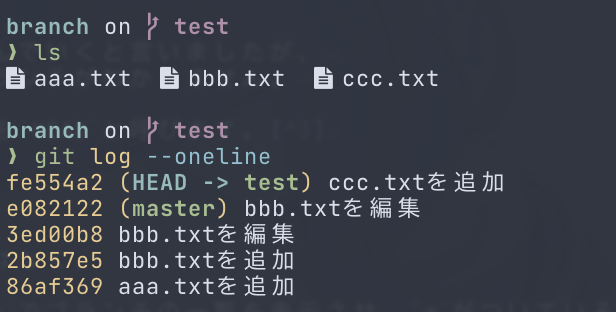
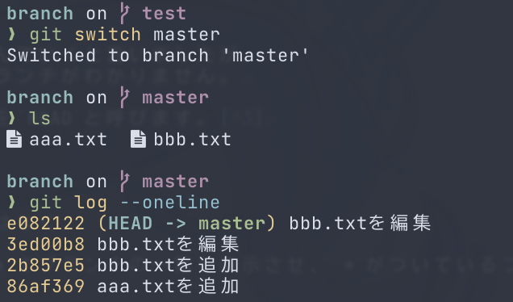

# ブランチ

ここではGitを使いこなす上で重要なブランチの解説を行います。


## ブランチとは

ブランチは **コミットの履歴を分岐して記録していくため** の機能です。
履歴を分岐することによって複数人での作業時にスムーズに作業をすることが出来たり、
ブランチごとに異なった意味合いを持たせることが可能です。
例えば特定のブランチは必ず動作するコードを置いておき、
別のブランチではベータ版の不安定なコードを置いておくといった運用や、
何か大きな機能を実装する時にその実装に関するコミットをまとめておくのに使うことが出来ます。


## Git上でのコミット履歴の表現

ブランチの解説の前にGitがコミットの履歴をどのように管理しているのかを見てみましょう。
Gitのコミットには以下のようなデータが含まれています。

- そのコミットで何を変更したのか(変更点)[^1]
- コミットメッセージ
- コミットした日時
- 誰がコミットしたか(名前とメールアドレス)
- **親となるコミットへの参照**

ここで重要なのが親となるコミットへの参照です。
これによって一つ前のコミットを指し示す事によってコミットの履歴を追うことが出来ます。
もちろん、リポジトリを作成して最初のコミットには親は存在しないため親となるコミットへの参照はありませんし、
今後説明する **マージコミット** と呼ばれるコミットには親となるコミットへの参照が複数含まれています。
しかし、基本的には一つのコミットには親となるコミットへの参照が含まれていることを覚えておきましょう。




## ブランチの仕組み

ブランチは特定のコミットを指す参照です。
`git init`でリポジトリを作成すると、`master`と呼ばれるブランチがデフォルトで作成されます。[^2]
`master`という名前ですが特に何か特別なブランチというわけではありません。



このブランチが指し示す参照先のコミットはコミットを繰り返していくと自動的に進んでいきます。




## ブランチを新しく作る方法

ブランチ関連の操作をする場合は`git branch`というコマンドを使います。
試しに`test`というブランチを作ってみます。ブランチを作るには`git branch <ブランチ名>`です。

```shell
git branch test
```

現在リポジトリに存在するブランチを見るには`git branch`を実行してください。



新しくブランチを作った場合は同じ位置を指し示す参照となります。




## `HEAD`

先程コミットを繰り返していくとブランチの参照は自動的に進んでいくと言いましたが、
今どのブランチで作業してるかが分からないと、進めるべきブランチがわかりません。

この今どのブランチで作業しているのかを指し示すための参照を`HEAD`と呼びます。[^3]



**`HEAD`は必ず一つだけです。**
また、ブランチを新しく作っただけでは`HEAD`が移動することはなく、
今は`master`ブランチで作業している事がわかります。
`HEAD`が指し示しているブランチを確認するには、`git branch`でブランチの一覧を表示させ、`*`がついているブランチ名を確認してください。


## ブランチの移動

ブランチ間を移動するには`git switch`コマンドを使います。
`git switch <ブランチ名>`で指定したブランチへ移動することが出来ます。

```shell
git switch test
```



なお存在しないブランチへ移動しようとするとエラーが起きますが、
`git switch -c <ブランチ名>`というように`-c`を足す事によってブランチの作成と移動を同時に行うことも可能です。

この状態で何か一つコミットをしてみましょう。
現在は`HEAD`が`test`ブランチを指し示している(`test`ブランチで作業している)ため、
コミットをすると`test`ブランチの参照が一つ進みます。



`ccc.txt`を追加したので、今作業ディレクトリには`ccc.txt`がありますし、`git log`でコミット履歴を見ると先程コミットした内容が表示されます。



ここでブランチを`master`に移動してみましょう。
`git switch`でブランチを移動し、作業ディレクトリとコミット履歴を見ると`ccc.txt`もないですし、先程のコミットは表示されません。



`HEAD`を`master`へ移動したため、`ccc.txt`を追加したコミットは見えなくなっています。
またブランチを移動したときに、作業ディレクトリの状態がそのブランチの最新のコミットに合わせられるため、`ccc.txt`は作業ディレクトリから消えています。
このコミットの内容から作業ディレクトリを復元することを **チェックアウト(Checkout)する** と言います。

---

[^1]: 正しくはステージする時に作られたスナップショットへの参照です。

[^2]: 最近のバージョンのGitを使用してる場合はこのデフォルトのブランチ名を設定で変更することが出来ます。詳しくは調べてみてください。

[^3]: どのブランチも指し示していない、detached HEADと呼ばれる状態になる場合もあります。
