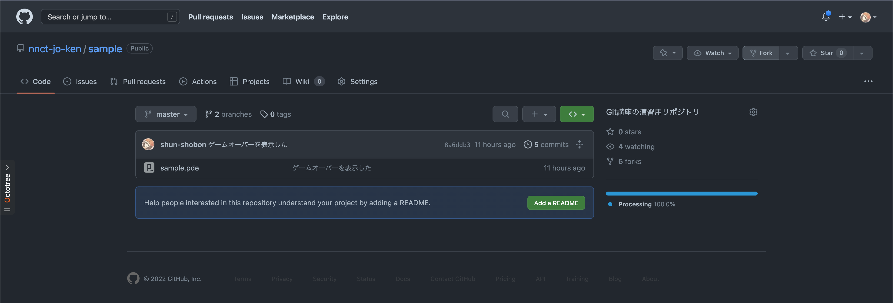
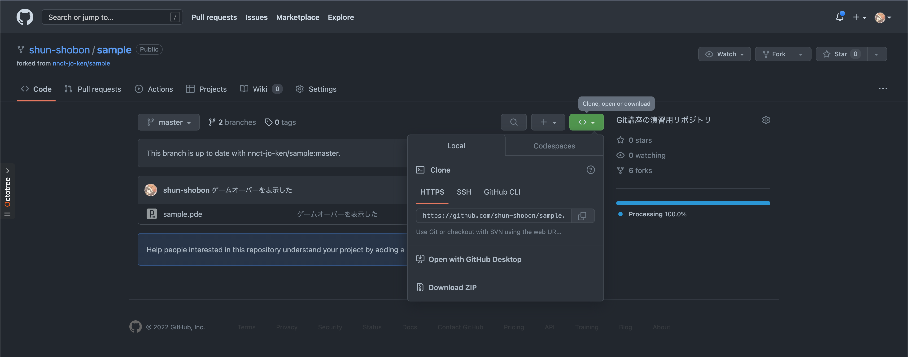
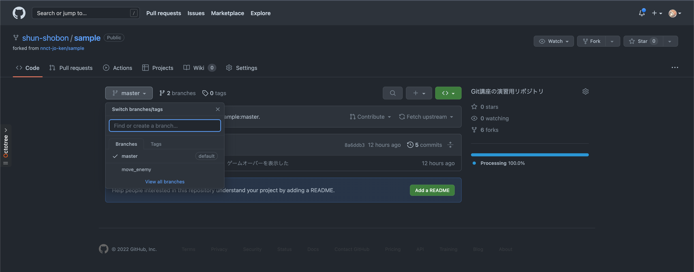
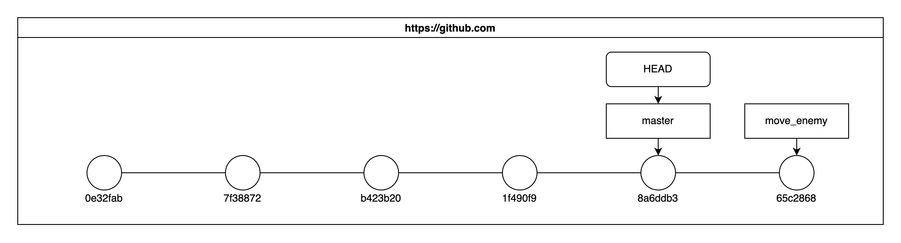
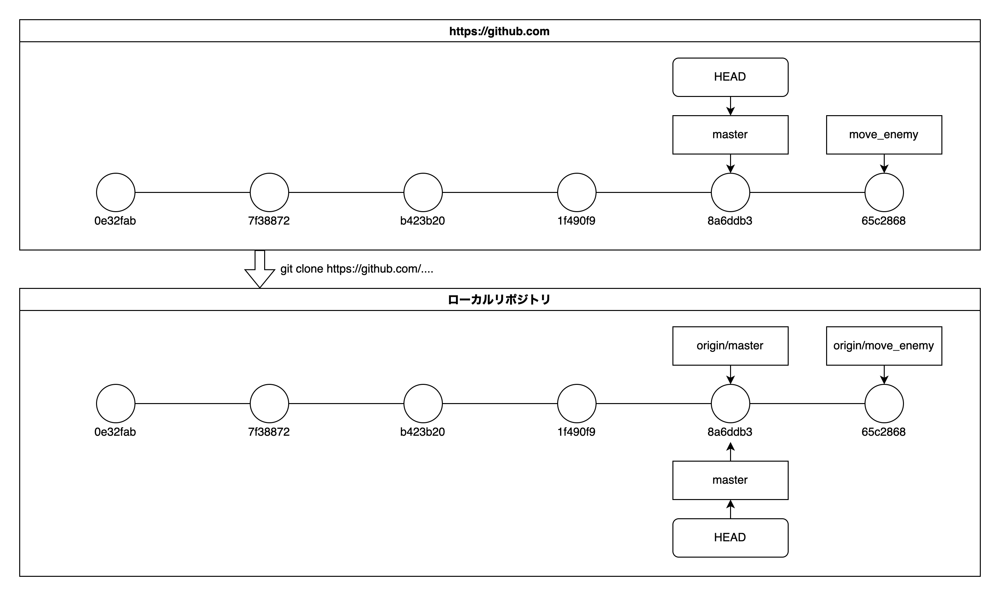

# クローン

今まではローカルリポジトリの作成は`git init`で行ってきました。
これは何もない真っ白なリポジトリを作成するコマンドです。
しかし、既存のリモートリポジトリから新しくローカルリポジトリを作りたいこともあります。
このとき使用するのが **クローン(Clone)** です。
クローンは文字通りリモートリポジトリの内容をほぼ全てコピーします。[^1]
そのため、仮にリモートリポジトリが置いてあるサーバーのディスクが破損しデータが飛んでしまったとしてもそのリモートリポジトリからクローンしてあったローカルリポジトリのいずれかを用いることによってデータのほとんどを復元することが出来ます。

## クローンをやってみる

クローンは以下のコマンドで可能です。
クローン先のディレクトリ名は省略可能です。省略した場合はURIの最後の`/`の先の`.git`を除いた名前が使用されます。

```shell
git clone <リポジトリのURI> [クローン先のディレクトリ名]
```

今回はサンプル用に[`sample`](https://github.com/nnct-jo-ken/sample)というリポジトリを用意しました。
このリポジトリは`nnct-jo-ken`にあるためこれをとりあえず自分のユーザにコピーしておきましょう。
この他人のリポジトリを自分のユーザスペースにコピーする操作のことをGitHubではフォーク(Fork)と呼びます。
本来はクローンのみであれば必要のない行為ですが、今回は後でこのリポジトリを弄る予定のためフォークします。

フォークはフォークしたいリポジトリのページで右上の「Fork」ボタンから可能です。
ボタンを押すとリポジトリ名等を決めるページに遷移しますが、特に変更せずに一番下の「Create fork」をクリックしてフォークしてください。



無事にフォークできれば自分のユーザスペース下に`sample`というリポジトリが作られると思います。

クローンするにはまずリポジトリのURIを取得する必要があります。
GitHubの場合はリポジトリのページにある緑色のボタンから可能です。



リポジトリのURIを入手したら早速クローンしてみましょう。
クローン先のディレクトリは、指定しない場合にはカレントディレクトリの下に作られるため、その点に留意しましょう。

```shell
git clone <先程コピーしたリポジトリのURI>
```

このリポジトリには[単発避けゲー](/ProcessingGame/Game_01.html)のコードが含まれています。
リポジトリにある`sample.pde`をProcessingで開いて実行してみてください。


## リモート追跡ブランチ

単発避けゲーのコードが含まれていると書きましたが、`master`ブランチのコードでは敵は動きません。
実はこのリポジトリには`master`以外にもう一つブランチが含まれています。

GitHub上で確認してみると`move_enemy`というブランチがあることがわかります。



しかしローカルリポジトリ上で`git branch`でブランチ一覧を表示しても`master`しか表示されません。
これはブランチにはローカルリポジトリ上で使用する通常のブランチとは別にリモートリポジトリ上のブランチを追跡するための **リモート追跡ブランチ** と呼ばれるブランチが存在します。[^2]

少し分かりづらいため図にして説明します。
現在リモートリポジトリ上には`master`と`move_enemy`という2つのブランチがあり、それぞれ図のようなコミット履歴があります。
また、リモートリポジトリ上での`HEAD`は`master`を指しています。



ここでリモートリポジトリからクローンを行います。
すると、リモートリポジトリ上のブランチは **リモート追跡ブランチ** としてローカルにも作られます。
リモート追跡ブランチは`<リモートリポジトリ名>/<リモートリポジトリでのブランチ名>`という形式で表されます。
今回の場合はリモートリポジトリ上の`master`と`move_enemy`は`origin/master`と`origin/move_enemy`という名前になります
(クローンしたときのリモートリポジトリ名はデフォルトで`origin`になることを思い出しましょう)。
リモート追跡ブランチという概念によってリモートリポジトリの状態を、
ローカルリポジトリ内の通常のブランチに影響を与えること無く追跡することができるようになるのです。



さて、ここまでリモート追跡ブランチについて長々と解説しましたが、
結局の所ローカルリポジトリ上で`origin/move_enemy`ブランチのコードを見るにはどうすればよいのでしょうか？
なお、リモート追跡ブランチは特殊なブランチのため、`git switch`でリモート追跡ブランチへ移動することは出来ません。
やり方としては`origin/move_enemy`と同じコミットを指し示す`move_enemy`というブランチを作る方法があります。
`git branch`や`git switch -c`を使ってもできそうですが、
Gitは賢いため、単に`git switch move_enemy`とするだけで自動的にブランチが作られ移動することが出来ます。[^3]

```shell
git switch move_enemy
```

これでようやく`move_enemy`のコードを見ることが出来ます。
ちなみに`move_enemy`にあるコードは不完全で、敵は動きますが画面外に行ってしまうとそのまま帰ってきません。
これを直すにはどうすればいいでしょうか？考えて修正してみましょう。修正したらコミットも忘れずに(次の講座で少し使います)。

---

[^1]: オプションである程度制御が可能です。

[^2]: リモートブランチと呼ぶこともあるようですが、言葉の使い方としては若干不正確です。

[^3]: リモートリポジトリが一つしかないなど条件がありますが、通常の使用では引っかかることはないでしょう。
