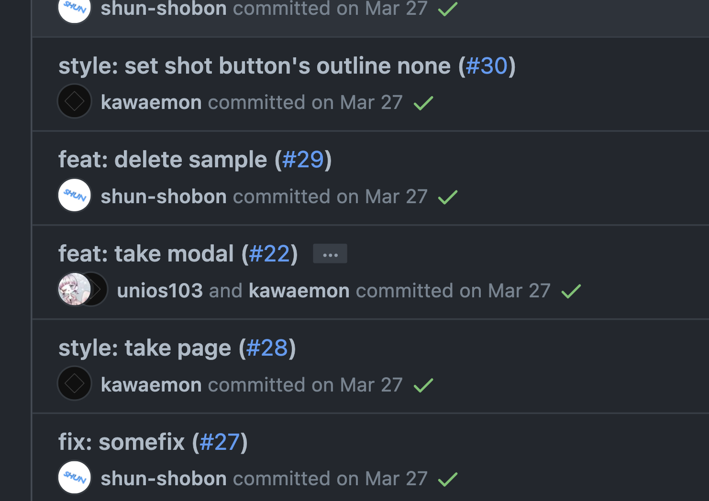
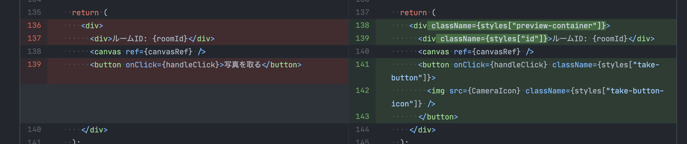

# Git / GitHub 講座

ここではGitとGitHubの使い方について解説します。
Gitはバージョン管理システムと呼ばれるもので、あなたが書いたプログラムのコード(ソースコード)を**円滑に**管理することができます。
ソースコード以外にもテキストファイルなら何でも管理することができ、小説やレポートなどを管理することもできます。
現在、IT業界の**デファクト・スタンダード**となっており**ITエンジニア･ITエンジニアになりたい人全員が使用しています。**
さらに複数人での共同開発に向いており、会社･部活･サークルなどで共同開発するときにほぼ必ず使われます。

## バージョン管理の利点

レポートやソースコードを管理するとき、｢もしかしたら前のものに戻したいからバックアップを取っておこう｣みたいに思ったことは無いでしょうか？
その場合、ファイル名に日付を付けたり番号をつけたりすると思いますが、大抵の場合こうなります。

- 提出レポート(1).docx
- 提出レポート_001.docx
- 提出レポート_2021-04-22.docx
- 提出レポート_最新.docx
- 提出レポート_最終版.docx
- 提出レポート\_最終版\_02.docx
- 提出レポート\_最終版\_提出済み.docx

こうなってしまうとどのファイルが最新なのか、どのファイルが最後から2番目のファイルなのかが分かりません。
Gitはこのような面倒なバージョン管理をすべて行ってくれます。一般的にGitの利点は以下のとおりです。

- 各変更をバージョンとして記録し、それをいつでも表示したりバージョンを戻したりできる
- いつ誰がどこを変更したかが表示できる(差分管理･表示)
- なんのために変更したのか理由を記入できる

他にもGitは **複数人での共同管理に対応しており、** 複数人で同時に1つのファイルを編集したとしてもきちんと統合することができます。

## GitHubとは

Gitがバージョン管理システムならばGitHubは何でしょうか？
先程、Gitでは複数人での共同管理に対応していると言いましたが、共同管理するにはGitで管理しているデータをサーバー上にアップロードし、共有する必要があります。
**サーバーというのは個人が簡単に運用ができるものではなく、** サーバーを借りたり契約する必要があり、運用にコスト(お金)がかかってしまいます。
GitHubはそういった悩みを解消するサービスです。GitHubは巨大なGitサーバーのようなもので、 **基本的に無料で** サービスを利用できます。
他にもGitHub独自の機能を有しており、共同開発するときにはほぼ必須のサービスとなっています。GitHubに類似したサービスとして、GitLabやBitbucketなどがあります。

