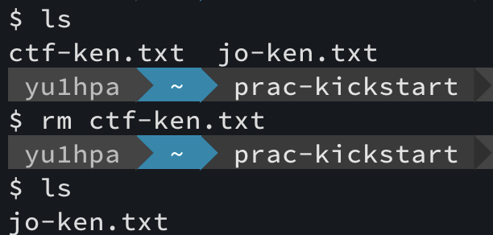
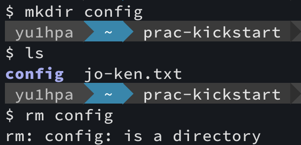
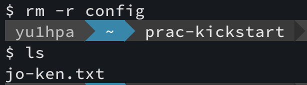
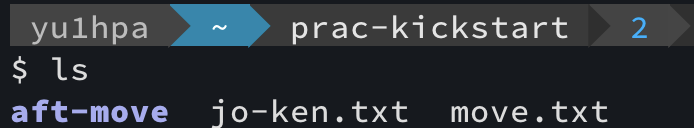
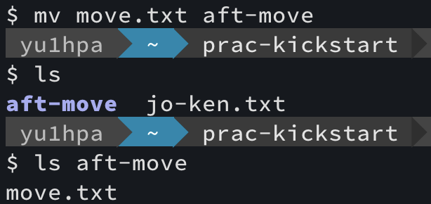
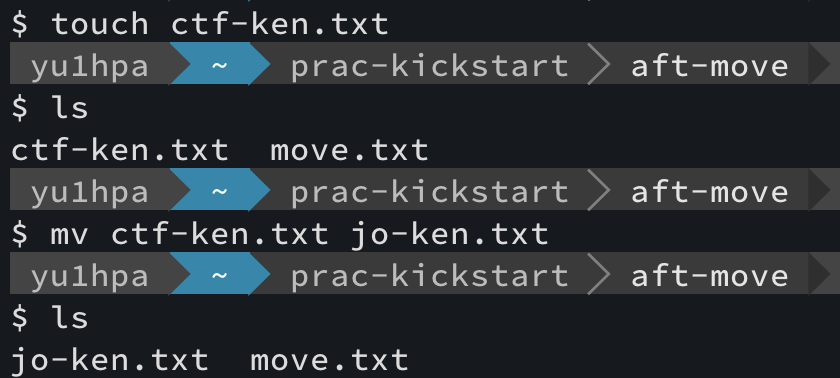

### lsコマンド
弟「ねぇねぇ、ﾆｲﾁｬﾝ」  
弟「ファイルやディレクトリを知りたいんだけど・・・」  
ﾆｲﾁｬﾝ「それなら`ls`コマンド打てばできるよ」  
ﾆｲﾁｬﾝ「打つと、次のように表示されるよ」  

ex.) $HOME/kickstart-programming/  

ﾆｲﾁｬﾝ「**`ls`は`list`の略と理解すると覚えやすいよ。**」  

### mkdirコマンド
弟「ねぇねぇﾆｲﾁｬﾝ」  
弟「新しくディレクトリ作りたいんだけど・・・」  
ﾆｲﾁｬﾝ「それなら`mkdir`コマンド打てば作れるよ」  
ﾆｲﾁｬﾝ「Home Directoryに`prac-kickstart`を作ってみよう」  

ex.) $HOME/

ﾆｲﾁｬﾝ「**`mkdir`は`make directory`の略と理解すると覚えやすいよ。**」  

### cdコマンド
弟「ねぇねぇﾆｲﾁｬﾝ」  
弟「今作ったディレクトリに移動したいんだけど・・・」  
ﾆｲﾁｬﾝ「それなら`cd`コマンド打てば移動できるよ」  
ﾆｲﾁｬﾝ「`prac-kickstart`に移動しよう！」  

ex.) $Home/

ﾆｲﾁｬﾝ「**`cd`は`change directory`の略と理解すると覚えやすいよ。**」  

### touchコマンド
弟「ねぇねぇﾆｲﾁｬﾝ」  
弟「作ったディレクトリに移動はできたんだけど、」  
弟「新しくファイル作りたい！！どうやったら作れるの？」  
ﾆｲﾁｬﾝ「それなら`touch`コマンドというのがあるよ」  
ﾆｲﾁｬﾝ「`jo-ken.txt`というファイルを作ってみよう！」  

ex.) $HOME/prac-kickstart/

ﾆｲﾁｬﾝ「`ls`してみると`jo-ken.txt`というファイルが出来てるね！」  
ﾆｲﾁｬﾝ「`touch`が何の略か知らないけど、」  
ﾆｲﾁｬﾝ「（物などに）**タッチして生成してると考えると覚えやすいよ**」  
ﾆｲﾁｬﾝ「使ってるうちに覚えられるから今わからなくても大丈夫！！」  

### rmコマンド
弟「ねぇねぇﾆｲﾁｬﾝ」  
弟「typo[^1]して`jo-ken.txt`じゃなくて`ctf-ken.txt`っていう
ファイル作っちゃったから消したいな」  
弟「わざとじゃないんだけどねhahah...」  

ﾆｲﾁｬﾝ「」  
ﾆｲﾁｬﾝ「...typoは誰にでもあるし、しょうがないよね」  
ﾆｲﾁｬﾝ「`rm`コマンドというのがあるからそれを使おう！」  

ex.) $HOME/prac-kickstart/

弟「なーるーほーどー(ﾌﾑﾌﾑ)」  
ﾆｲﾁｬﾝ「（どこかで聞いたような・・・気のせいか）」  
ﾆｲﾁｬﾝ「`rm`は`remove`の略と理解すると覚えやすいよ！」  

（ちなみに・・・）  
directoryを消したい場合は、`rm`だけでは消せません。  
例えば、任意のdirectory(ここでは`config`)を消したい場合、
`-r`オプションを付与してあげる必要があります。

ex.) $HOME/prac-kickstart/

`rm: filname: is a directory`（これはディレクトリですよ）と言われて
削除できません。  
そこで`-r`オプションを付与してあげます。  

任意のdirectoryを消すことが出来ます。  

#### オプション

|オプション|動作                  |例                |
|----------|----------------------|------------------|
|-r        |directory削除         |rm -r \<any_name> |
|-f        |強制的に削除          |rm -rf \<any_name>|
|-i        |削除時に確認メッセージ|rm -i \<any_name> |

### mvコマンド
弟「ねぇねぇﾆｲﾁｬﾝ」  
弟「`aft-move`directoryに`move.txt`を移動させたいんだけど・・・」  
ﾆｲﾁｬﾝ「ファイルを移動させるなら`mv`コマンドというのがあるからそれを使おう！」  

> $HOME/prac-kickstart下に[mkdirコマンド](###mkdirコマンド)と
> [touchコマンド](###touchコマンド)を使って`aft-move`というdirectoryと
> `move.txt`というファイルを作ろう(PATHは、$HOME/prac-kickstart/aft-move ,
> $HOME/prac-kickstart/move.txtとなっていれば良い)

ex.) $HOME/prac-kickstart

> Usage: mv: mv <移動されるfile> <移動するdirectory>  
> コマンドを打つときのイメージは、左から右に移動する感じだよ

ﾆｲﾁｬﾝ「`prac-kickstart/`から`move.txt`が`prac-kickstart/aft-move`に移動したことがわかるね」  
弟「おお〜！確かにー！」  

ﾆｲﾁｬﾝ「`mv`コマンドは、ファイルの移動だけじゃなくて、**ファイル名を変更することが可能**だよ」  
弟「どういうこと・・・？」  
ﾆｲﾁｬﾝ「例えば、`aft-move/`に移動して、`jo-ken.txt`を作りたかったのに`ctf-ken.txt`を作ってしまったとする」  
ﾆｲﾁｬﾝ「[rmコマンド](###rmコマンド)では一回削除して作り直していたけど、少し手間だよね。」  
ﾆｲﾁｬﾝ「そこで、`mv`コマンドを使うんだ」  

> 実際は、どのdirectoryでやってもok。  
> また、atf-move/にctf-ken.txtを作ろう。（参照[touchコマンド](###touchコマンド)）

ex.) $HOME/prac-kickstart

> Usage: mv: mv <変更前のfile名> <変更後のfile名>  

ﾆｲﾁｬﾝ「`ctf-ken.txt`から`jo-ken.txt`に変更されたことがわかるね」  
弟「これで`ctf-ken.txt`をわざわざ削除して作り直さなくてもいいから手間が省けた！」  

[^1]: typoとは「打ち間違い」のこと
