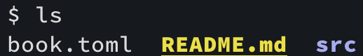
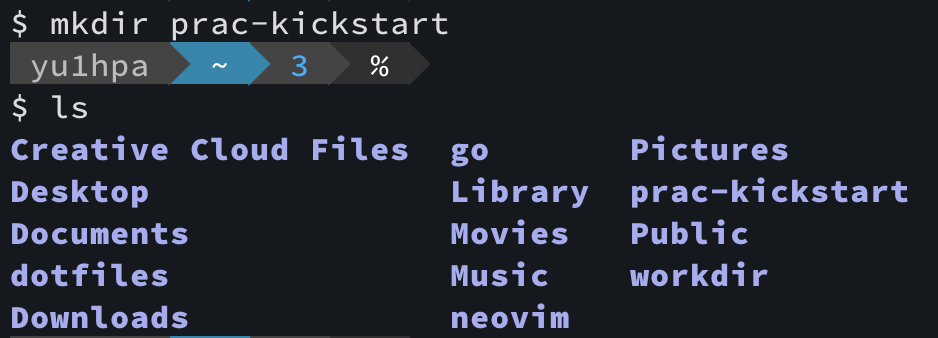
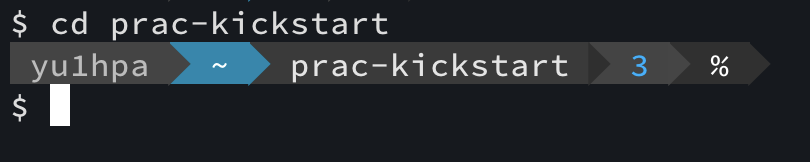
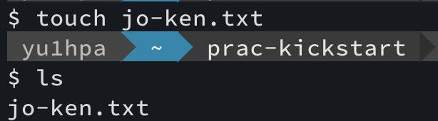

### lsコマンド
弟「ねぇねぇ、ﾆｲﾁｬﾝ」  
弟「ファイルやディレクトリを知りたいんだけど・・・」  
ﾆｲﾁｬﾝ「それなら`ls`コマンド打てばできるよ」  
ﾆｲﾁｬﾝ「打つと、次のように表示されるよ」  

ex.) $HOME/kickstart-programming/  

ﾆｲﾁｬﾝ「**`ls`は`list`の略と理解すると覚えやすいよ。**」  

### mkdirコマンド
弟「ねぇねぇﾆｲﾁｬﾝ」  
弟「新しくディレクトリ作りたいんだけど・・・」  
ﾆｲﾁｬﾝ「それなら`mkdir`コマンド打てば作れるよ」  
ﾆｲﾁｬﾝ「Home Directoryに`prac-kickstart`を作ってみよう」  

ex.) $HOME/

ﾆｲﾁｬﾝ「**`mkdir`は`make directory`の略と理解すると覚えやすいよ。**」  

### cdコマンド
弟「ねぇねぇﾆｲﾁｬﾝ」  
弟「今作ったディレクトリに移動したいんだけど・・・」  
ﾆｲﾁｬﾝ「それなら`cd`コマンド打てば移動できるよ」  
ﾆｲﾁｬﾝ「`prac-kickstart`に移動しよう！」  

ex.) $Home/

ﾆｲﾁｬﾝ「**`cd`は`change directory`の略と理解すると覚えやすいよ。**」  

### touchコマンド
弟「ねぇねぇﾆｲﾁｬﾝ」  
弟「作ったディレクトリに移動はできたんだけど、」  
弟「新しくファイル作りたい！！どうやったら作れるの？」  
ﾆｲﾁｬﾝ「それなら`touch`コマンドというのがあるよ」  
ﾆｲﾁｬﾝ「`jo-ken.txt`というファイルを作ってみよう！」  

ex.) $HOME/prac-kickstart/

ﾆｲﾁｬﾝ「`ls`してみると`jo-ken.txt`というファイルが出来てるね！」  
ﾆｲﾁｬﾝ「`touch`が何の略か知らないけど、」  
ﾆｲﾁｬﾝ「（物などに）**タッチして生成してると考えると覚えやすいよ**」  
ﾆｲﾁｬﾝ「使ってるうちに覚えられるから今わからなくても大丈夫！！」  
