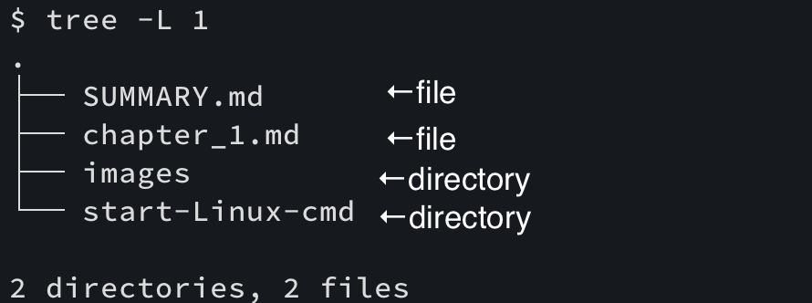

## ディレクトリとは？
弟「ねぇねぇﾆｲﾁｬﾝ」  
弟「ディレクトリ(以下directory)is 何？」  

ﾆｲﾁｬﾝ「directoryっていうのは、フォルダみたいなものだよ」  
ﾆｲﾁｬﾝ「具体例を示してみるね（階層をわかりやすくするために`tree`コマンド[^1]を用いる）」  

ex.) $HOME/kickstart-programming/src

ﾆｲﾁｬﾝ「フォルダじゃなくて、`directory`という表現を用いるから覚えておこう！」  

弟「なるほど！フォルダっていう風に思えばいいのか！」  
弟「ありがとう、ﾆｲﾁｬﾝ！！」  

[^1]: `tree`: 予め入っていないので、使う場合は別途インストールが必要  
