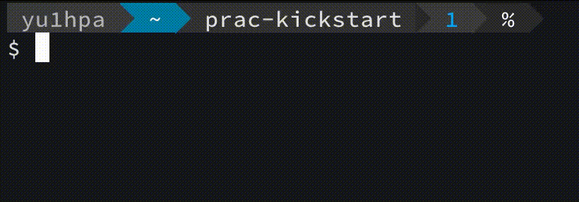

## Linuxコマンドとは何か
弟「ねぇねぇ、ﾆｲﾁｬﾝ」  
弟「Linuxコマンドってなに？」  

ﾆｲﾁｬﾝ「Linuxコマンドは、**コンピュータに何を実行させるのか
（という命令）を送ることができるもの**だよ」  

弟「え？...どういうこと？」  

ﾆｲﾁｬﾝ「こんな感じ！！」  

（「who are you」という文字列を表示するコマンドの例）

ﾆｲﾁｬﾝ「具体的にどんなコマンドがあるか次章で説明するよ！！」  

弟「はーーい！ﾉｼ」
