# WSL2とは

WSL2(Windows Subsystem for Linux 2)は、Windows10上でLinuxを動作させるための
仕組みです。(LinuxはWindowsと同じOSの一種です。詳細は他の資料を参照してください。)
（電子情報工学科生はCygwinを学校で導入したと思います。これとWSL2は似ている存在ではありますが、システムは全く違います。また、利点はCygwinよりもWSL2のほうが多いです。）

利点としては、以下の例が挙げられます。

- ファイルにアクセスする速度が早い
- 原理上Linuxと100%の互換性がある
- Linuxと互換性があるため、Linuxの機能は全て使える

以上の利点から、ここではWSL2を導入していきます。
（CygwinはWSL2を導入しても使うことができるので、アンインストールする必要はありません。）

# WSL2の導入
WSL2を導入していきます。導入は<a href="https://docs.microsoft.com/ja-jp/windows/wsl/install-win10">Microsoftの公式ドキュメント</a>の手順で行っていきます。

## 1.Linux用Windowsサブシステムを有効にする
Windows上にLinuxディストリビューションをインストールする前に、まず
"Linux用Windowsサブシステム"を有効にする必要があります。

はじめに、管理者としてPowerShellを開きます。

Windowsの検索窓からPowerShellと入力し、「管理者として実行する」を選択してください。

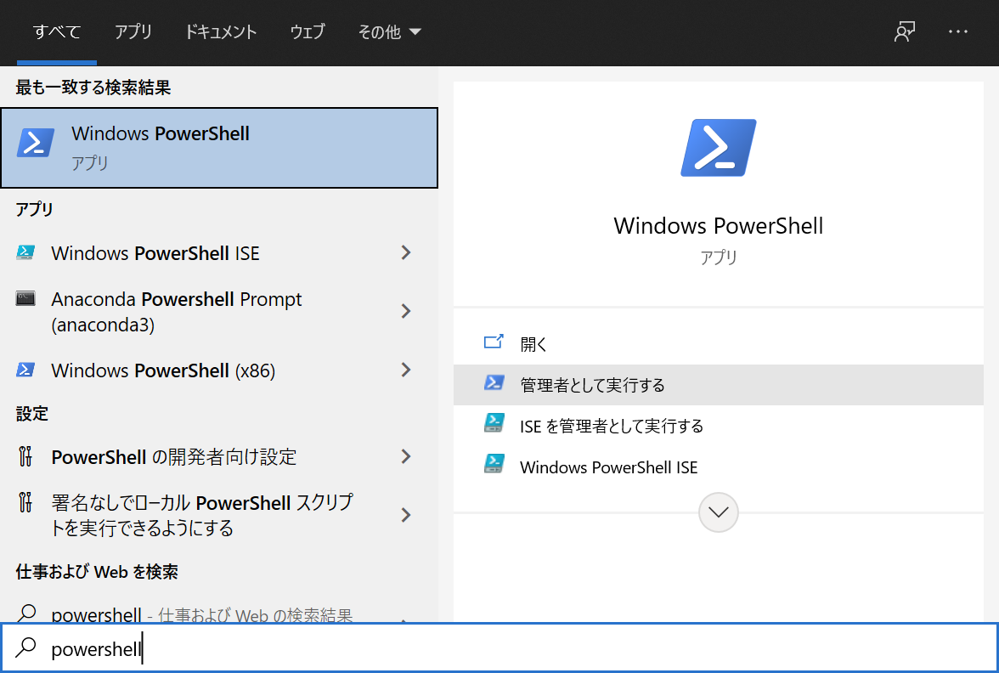

選択した後、「このアプリがデバイスに変更を加えることを許可しますか？」と尋ねられるので、「はい」を選択してください。

PowerShellが起動したら、以下のコマンドを実行してください。
```
dism.exe /online /enable-feature /featurename:Microsoft-Windows-Subsystem-Linux /all /norestart
```
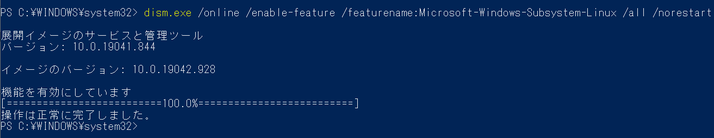

「操作は正常に完了しました。」と表示されたら、"Linux用Windowsサブシステム"が有効になりました。次の手順に進みましょう。

## 2.WSL2の実行に関する要件を確認する
WSL2は、以下のシステム要件が必要です。
- x64システムの場合:バージョン1903以降、ビルド18362以上
- ARM64システムの場合:バージョン2004以降、ビルド19041以上

設定からシステム>詳細情報へ進んで、"システムの種類"・"バージョン"・"OSビルド"を
確認してください。

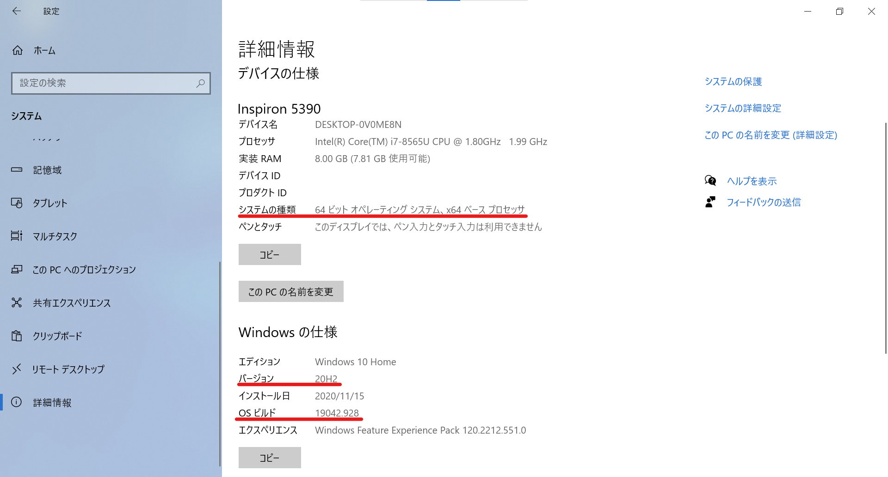

上記のシステム要件を満たしていることを確認できたら、次の手順に進みましょう。

## 3.仮想マシンの機能を有効にする
WSL2をインストールする前に、"仮想マシンプラットフォーム"を有効にする必要があります。

PowerShellを閉じた場合は、もう一度管理者としてPowerShellを開いてください。

PowerShellで以下のコマンドを実行してください。
```
dism.exe /online /enable-feature /featurename:VirtualMachinePlatform /all /norestart
```
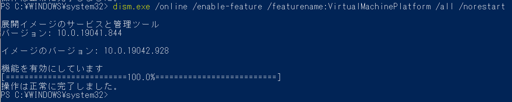

「操作が正常に完了しました。」と表示されたら、"仮想マシンプラットフォーム"が有効になりました。

有効化したことを確認したら、コンピュータを再起動してください。コンピュータを再起動しないと、Linux用Windowsサブシステムと仮想マシンプラットフォームは完全に有効化されません。

コンピュータが再起動できたら、次の手順に進みます。

## 4.Linuxカーネル更新プログラムパッケージをダウンロードする
Linuxカーネル更新プログラムパッケージの最新のパッケージをダウンロードします。

"2.WSL2の実行に関する要件を確認する"で確認した"システムの種類"に応じて以下のパッケージをダウンロードしてください。

<a href="https://wslstorestorage.blob.core.windows.net/wslblob/wsl_update_x64.msi">x64マシン用WSL2 Linux カーネル更新プログラムパッケージ</a>

<a href="https://wslstorestorage.blob.core.windows.net/wslblob/wsl_update_arm64.msi">ARM64マシン用WSL2 Linux カーネル更新プログラムパッケージ</a>

ダウンロードしたら、更新プログラムパッケージを実行します。

エクスプローラーを開いて、ダウンロードフォルダへ進み、"wsl_update_x64.msi"を実行し、更新プログラムパッケージをインストールします。

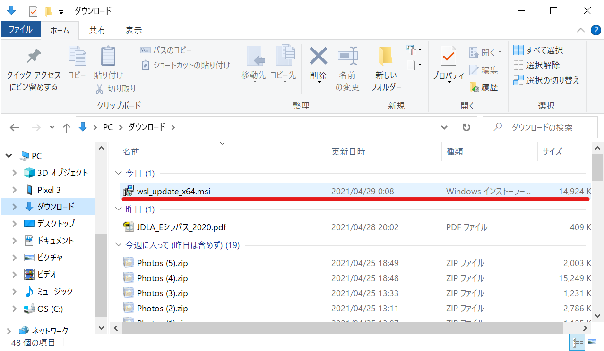

（管理者特権のアクセス許可を求めるメッセージが表示される場合があるので、「はい」を選択して、このインストールを承認します。）

インストールが完了すると、次のウィンドウが表示されます。

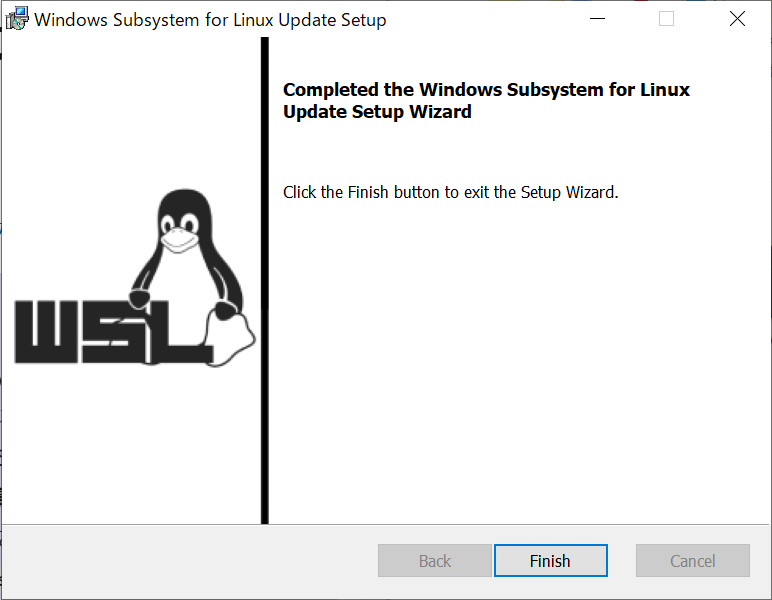

表示されたら、"Finish"を選択し、次の手順に進みます。

## 5.WSL2を既定のバージョンとして設定する
新しいLinuxディストリビューションをインストールする際の規定のバージョンとしてWSL2を設定します。

PowerShellを開いて（今回は管理者としてPowerShellを開く必要はありません）
次のコマンドを実行し、新しいLinuxディストリビューションをインストールする際の既定バージョンとしてWSL2を設定します。
```
wsl --set-default-version 2
```
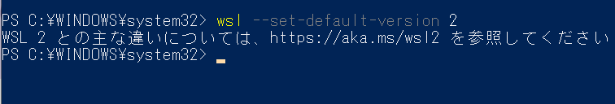

## 6.選択したLinuxディストリビューションをインストールする
ディストリビューションとはOSを構築するための必要な諸々のソフトも含めた配布形態のことです。今回は"Ubuntu"を選択します。（他にも、CentOS・KaliLinuxなどたくさんのディストリビューションがあります。）

Microsoft Storeを起動して"Ubuntu"と検索し、Ubuntuを選択します。

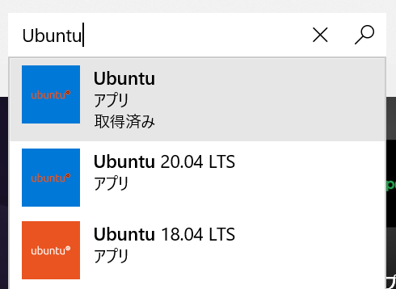

表示されたページの「入手」を選択し、インストールを開始します。
（下の画像では、Ubuntu 20.04 LTSになっていますが、操作は変わりません。）

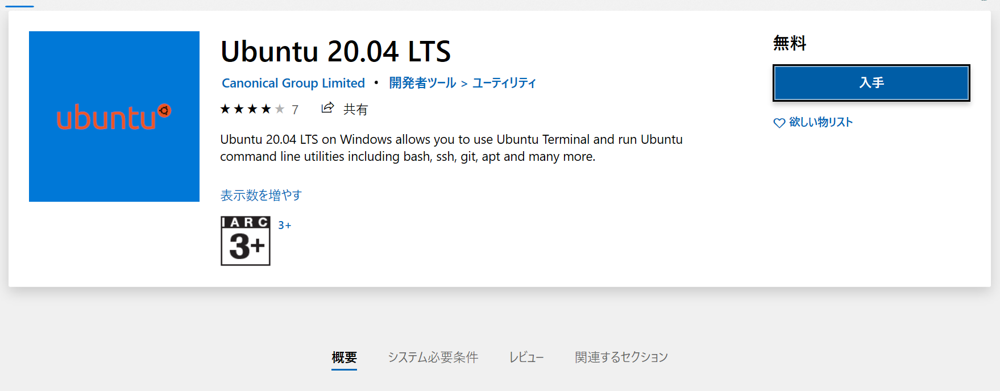

インストールが完了すると、右下に以下の通知が表示されるので、起動を選択します。

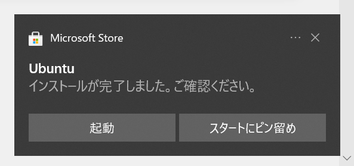

起動して、少し待つと、Ubuntuで使用するusernameとpasswordの設定を求められるので入力します。

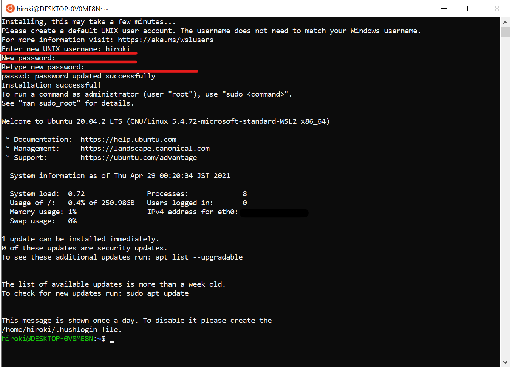

ここで設定したpasswordの使用頻度はかなり多い（ソフトウェアのダウンロード、管理者での操作など）ので、必ず覚えておく、またはメモとして取っておくようにしてください。

コマンドが打ち込める状態になったら、WSL2の導入は終了です。
WSL2上でUbuntuを使うときはスタートメニューからUbuntuを選択して、実行することで、
使用することができます。
